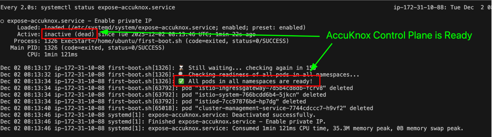

# AWS Control Plane Installation

This guide details the steps to install the AccuKnox Control Plane using an AWS AMI.

## Import the AMI to S3 Bucket

Use the following command to import the AMI:

```bash
aws ec2 create-restore-image-task \
 --bucket <S3_Bucket_name> \
 --object-key <AMI_FILE_NAME> \
 --name "AccuKnox Standalone v3.2-Jan-10-26"
```

To check the status of the import, run:

```bash
aws ec2 describe-images \
 --image-ids <AMI_ID> \
 --query 'Images[0].State'
```

!!! note
    The S3 bucket must be in the same region where the AccuKnox Control Plane instance will be deployed.


## EC2 Instance Creation

Create an EC2 instance with the provided AMI using the following specifications:

| Specification | Value |
| :--- | :--- |
| **Instance Type** | `m5a.2xlarge` |
| **Root Disk Size** | `256GB` |

### Security Group Settings

Ensure the security group allows the following inbound access:

*   **SSH**: `tcp/22`
*   **Application Access**: `tcp/443`, `tcp/5000`, `tcp/30001` (Only Inbound access)


## Check Status of AccuKnox Control Plane Service

SSH into the EC2 instance (username: `ubuntu`) and check the service status:

```bash
watch systemctl status expose-accuknox.service
```




## Verify the Installation

Navigate to the browser and access the AccuKnox Control Plane Interface using the instance IP:

```
https://<EC2-Instance-IP>/
```

!!! note
    You will need to accept the self-signed certificates in your browser to proceed.

This should bring up the AccuKnox Control Plane Interface.

### Accessing via Public IP

If you wish to access the AccuKnox Control Plane via a Public IP, you must update the IP in the UI config map.

1.  SSH into the VM.
2.  Edit the environment config map:

    ```bash
    kubectl edit cm env-config -n accuknox-ui
    ```

3.  Replace the private IP with the public IP. In `vi` editor, you can use the following command:

    ```vim
    :%s/<privateIP>/<PublicIP>/g
    # Example: :%s/10.10.23.22/98.92.33.72/g
    ```

4.  Restart the UI pods to apply changes:

    ```bash
    kubectl delete pods --all -n accuknox-ui
    ```

5.  To sign up, access:

    ```
    https://<Public-IP>/sign-up
    ```

