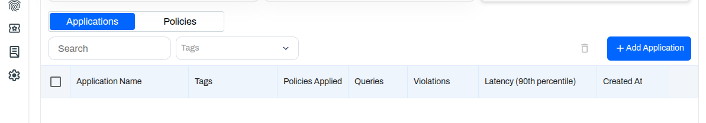
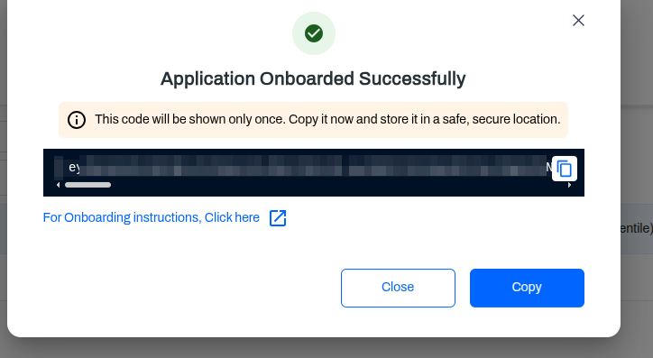

# End-to-End Runtime Prompt Firewall Setup for Azure AI Foundry

## Objective

Route **all user prompts** sent to Azure AI Foundry through **AccuKnox LLM Defence** first, using **Azure API Management (APIM)**, with the following guarantees:

- Client never talks to Foundry directly

- Only the user question is sent to AccuKnox

- Full payload is preserved for Foundry

- Requests are blocked if AccuKnox returns BLOCK

- Foundry is called only if allowed

- Secrets are stored securely in APIM

- Client code remains unchanged except endpoint + key

## Final Runtime Flow

```
Client
  |
  | POST /foundry/models/chat/completions
  | Authorization: Bearer <CLIENT_TOKEN>
  | (full LLM payload)
  |
Azure API Management (APIM)
  |
  |──► AUTHENTICATION (Inbound – fail fast)
  |     - Read Authorization header
  |     - Strip "Bearer "
  |     - Compare token with {{AI_FOUNDRY_API_KEY}}
  |     - If mismatch / missing → 401 Unauthorized
  |
  |──► PRESERVE REQUEST
  |     - Preserve full original request body
  |
  |──► PROMPT EXTRACTION
  |     - Extract messages[0].content only
  |
  |──► PROMPT SECURITY CHECK
  |     - POST to AccuKnox LLM Defence
  |       {
  |         "query_type": "prompt",
  |         "content": "<user prompt>"
  |       }
  |
  |──► PROMPT DECISION
  |     - If BLOCK → 403 (Foundry NOT called)
  |     - If ALLOW / MONITOR → continue
  |
  |──► BACKEND INVOCATION
  |     - Forward ORIGINAL payload (unchanged)
  |     - Replace Authorization header with
  |       Bearer {{AI_FOUNDRY_API_KEY}}
  |
  v
Azure AI Foundry
  |
  |──► MODEL INFERENCE
  |     - Full LLM payload processed
  |
  |──► RESPONSE RETURNED
  |
  v
Azure API Management (APIM)
  |
  |──► RESPONSE PRESERVATION
  |     - Preserve full Foundry response
  |
  |──► RESPONSE EXTRACTION
  |     - Extract choices[0].message.content
  |
  |──► RESPONSE SECURITY CHECK
  |     - POST to AccuKnox LLM Defence
  |       {
  |         "query_type": "response",
  |         "content": "<model output>",
  |         "session_id": "<prompt session id>"
  |       }
  |
  |──► RESPONSE DECISION
  |     - If BLOCK → 403 (response suppressed)
  |     - If ALLOW / MONITOR → return response
  |
  v
Client
```

## Prerequisites

- Azure API Management instance (Developer / Premium recommended)

- Azure AI Foundry model deployed

- Working Foundry inference curl:

```
POST https://ai-prompt-firewall-openai.services.ai.azure.com/models/chat/completions
```

- AccuKnox LLM Defence API access + bearer token

- APIM Product with subscription enabled

## STEP 1 — Create Backends in APIM

### 1.1 Foundry Backend

APIM → Backends → Add

| Field        | Value                                                     |
| ------------ | --------------------------------------------------------- |
| Name         | `foundry-backend`                                         |
| Backend type | HTTP                                                      |
| URL          | `https://ai-prompt-firewall-openai.services.ai.azure.com` |
| TLS          | Enabled                                                   |

!!! note
    Do not include `/models` or `/chat`

### 1.2 AccuKnox LLM Defence Backend

APIM → Backends → Add

| Field        | Value                                |
| ------------ | ------------------------------------ |
| Name         | `llm-defence-backend`                |
| Backend type | HTTP                                 |
| URL          | `https://cwpp.<domain>.accuknox.com` |
| TLS          | Enabled                              |

## STEP 2 — Store Secrets Securely (Named Values)

APIM → Named values → Add

### 2.1 Foundry API Key

| Field  | Value                |
| ------ | -------------------- |
| Name   | `AI_FOUNDRY_API_KEY` |
| Value  | `<foundry-api-key>`  |
| Secret |   Enabled            |

### 2.2 AccuKnox Defence Token

| Field  | Value                       |
| ------ | --------------------------- |
| Name   | `LLM_DEFENCE_TOKEN`         |
| Value  | `<Enter Application Token>` |
| Secret |   Enabled                   |

#### In order to get “LLM_DEFENCE_TOKEN“

1.Login to platform.

2.Go to AI/ML Security → Applications-> Prompt Firewall

3.Click on Add Application. Enter Application name and tags. Click on add.



4.Copy the generated LLM_DEFENCE_TOKEN.



## STEP 3 — Create a New API (Separate)

APIM → APIs → Add API → HTTP

| Field           | Value                |
| --------------- | -------------------- |
| Display name    | Foundry Models Proxy |
| Name            | foundry-models-proxy |
| URL scheme      | HTTPS                |
| API URL suffix  | `foundry`            |
| Web service URL | _(leave empty)_      |

This exposes:

```
https://<apim-name>.azure-api.net/foundry
```
## STEP 4 — Create Operation (Matches Foundry API)

APIM → APIs → Foundry Models Proxy → Add operation

| Field        | Value                      |
| ------------ | -------------------------- |
| Display name | Chat Completions           |
| Name         | chat-completions           |
| Method       | POST                       |
| URL          | `/models/chat/completions` |

!!! note
    Do not include query params here

## STEP 5 — Attach API to Product (Mandatory)

APIM → Products → Starter / Unlimited

- Add Foundry Models Proxy

- Ensure product has an active subscription

!!! note
    Clients will use the APIM subscription key

## STEP 6 — API Policy (CORE LOGIC)

Apply at:

    APIM → APIs → Foundry Models Proxy → All operations → Policies

### FINAL PRODUCTION POLICY (READY TO PASTE)

``` xml
<policies>
    <inbound>
        <base />
        <!-- 🔐 AUTHENTICATION -->
        <set-variable name="clientBearer" value="@{
                        var auth = context.Request.Headers.GetValueOrDefault("Authorization", "");
                        return auth.StartsWith("Bearer ")
                            ? auth.Substring(7)
                            : "";
                        }" />
        <choose>
            <when condition="@(
            string.IsNullOrEmpty((string)context.Variables["clientBearer"]) ||
            (string)context.Variables["clientBearer"] != "{{AI_FOUNDRY_API_KEY}}"
            )">
                <return-response>
                    <set-status code="401" reason="Unauthorized" />
                    <set-header name="Content-Type" exists-action="override">
                        <value>application/json</value>
                    </set-header>
                    <set-body>{
                    "error": "Invalid or missing bearer token"
                }</set-body>
                </return-response>
            </when>
        </choose>
        <!-- Preserve original request body -->
        <set-variable name="originalBody" value="@(context.Request.Body.As<string>(preserveContent: true))" />
        <!-- Extract user prompt -->
        <set-variable name="userPrompt" value="@{
                    var body = context.Request.Body.As<JObject>(preserveContent: true);
                    return (string)body["messages"]?[0]?["content"];
                  }" />
        <!-- Call AccuKnox LLM Defence (PROMPT scan) -->
        <send-request mode="new" response-variable-name="llmDefenceResponse" timeout="10" ignore-error="false">
            <set-url>https://cwpp.airindia.accuknox.com/llm-defence/application-query</set-url>
            <set-method>POST</set-method>
            <set-header name="Content-Type" exists-action="override">
                <value>application/json</value>
            </set-header>
            <set-header name="Authorization" exists-action="override">
                <value>Bearer {{LLM_DEFENCE_TOKEN}}</value>
            </set-header>
            <set-body>@{
          return new JObject(
            new JProperty("query_type", "prompt"),
            new JProperty("content", (string)context.Variables["userPrompt"])
          ).ToString();
        }</set-body>
        </send-request>
        <!-- Parse defence response -->
        <set-variable name="defenceResult" value="@(((IResponse)context.Variables["llmDefenceResponse"])
                          .Body.As<JObject>())" />
        <!-- Store session_id for response correlation -->
        <set-variable name="defenceSessionId" value="@(((JObject)context.Variables["defenceResult"])
                          ["session_id"]?.ToString())" />
        <!-- Block if prompt is unsafe -->
        <choose>
            <when condition="@(
        ((JObject)context.Variables["defenceResult"])
          ["query_status"]?.ToString() == "BLOCK"
      )">
                <return-response>
                    <set-status code="403" reason="Blocked by LLM Defence" />
                    <set-header name="Content-Type" exists-action="override">
                        <value>application/json</value>
                    </set-header>
                    <set-body>{
              "error": "Prompt blocked by LLM Defence",
              "severity": "@(((JObject)context.Variables["defenceResult"])["overall_severity"])",
              "reason": "@(((JObject)context.Variables["defenceResult"])["description"])"
            }</set-body>
                </return-response>
            </when>
        </choose>
        <!-- Forward request to Foundry -->
        <set-backend-service backend-id="foundry-backend" />
        <set-header name="Authorization" exists-action="override">
            <value>Bearer {{AI_FOUNDRY_API_KEY}}</value>
        </set-header>
        <set-header name="Content-Type" exists-action="override">
            <value>application/json</value>
        </set-header>
    </inbound>
    <backend>
        <base />
    </backend>
    <outbound>
        <base />
        <!-- Preserve model response -->
        <set-variable name="modelResponse" value="@(context.Response.Body.As<JObject>(preserveContent: true))" />
        <!-- Extract assistant content -->
        <set-variable name="assistantContent" value="@(
                    (string)((JObject)context.Variables["modelResponse"])
                      ["choices"]?[0]?["message"]?["content"]
                  )" />
        <!-- Call AccuKnox LLM Defence (RESPONSE scan) -->
        <send-request mode="new" response-variable-name="llmDefenceResponseScan" timeout="10" ignore-error="false">
            <set-url>https://cwpp.airindia.accuknox.com/llm-defence/application-query</set-url>
            <set-method>POST</set-method>
            <set-header name="Content-Type" exists-action="override">
                <value>application/json</value>
            </set-header>
            <set-header name="Authorization" exists-action="override">
                <value>Bearer {{LLM_DEFENCE_TOKEN}}</value>
            </set-header>
            <set-body>@{
          return new JObject(
            new JProperty("query_type", "response"),
            new JProperty("content", (string)context.Variables["assistantContent"]),
            new JProperty("session_id", (string)context.Variables["defenceSessionId"])
          ).ToString();
        }</set-body>
        </send-request>
        <!-- Parse response scan -->
        <set-variable name="responseDefenceResult" value="@(((IResponse)context.Variables["llmDefenceResponseScan"])
                          .Body.As<JObject>())" />
        <!-- Block if response is unsafe -->
        <choose>
            <when condition="@(
        ((JObject)context.Variables["responseDefenceResult"])
          ["query_status"]?.ToString() == "BLOCK"
      )">
                <return-response>
                    <set-status code="403" reason="Response blocked by LLM Defence" />
                    <set-header name="Content-Type" exists-action="override">
                        <value>application/json</value>
                    </set-header>
                    <set-body>{
              "error": "Model response blocked by LLM Defence",
              "session_id": "@(context.Variables["defenceSessionId"])"
            }</set-body>
                </return-response>
            </when>
        </choose>
    </outbound>
    <on-error>
        <base />
    </on-error>
</policies>
```

## STEP 7 — Client Usage

Client → APIM (NOT Foundry)

``` sh
curl -X POST \
  "https://<apim-name>.azure-api.net/foundry/models/chat/completions?api-version=2024-05-01-preview" \
  -H "Content-Type: application/json" \
  -H "Bearer: AI_FOUNDRY_API_KEY" \
  -d '{
    "messages": [
      { "role": "user", "content": "I am going to Paris, what should I see?" }
    ],
    "model": "mistral-medium-2505",
    "max_tokens": 2048,
    "temperature": 0.8,
    "top_p": 0.1
  }'
```

## Behavior Summary

| Scenario                   | Result                       |
| -------------------------- | ---------------------------- |
| AccuKnox returns `BLOCK`   | ❌ 403, Foundry not called    |
| AccuKnox returns `ALLOW`   | ✅ Request forwarded          |
| AccuKnox returns `MONITOR` | ✅ Request forwarded          |
| Defence API down           | ❌ Fail-closed (configurable) |
| Client sees Foundry key    | ❌ Never                      |

### Extensible By Design

This architecture supports:

- Monitor-only mode

- Severity thresholds

- Multi-message extraction

- Async / shadow scanning

- Policy fragments

- Tenant-aware routing

- Prompt + response logging
