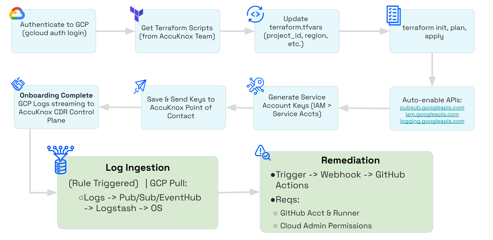

# CDR for GCP Setup Guide

!!! note "Remediation Setup"
    For remediation setup for AWS, Azure and GCP CDR please refer to the following links:

    - [Remediate Alerts](/getting-started/cdr-setup)

## **Introduction**
AccuKnox CDR for GCP is deployed using terraform scripts, the scripts deployes the following resources:

| Resource    | Purpose |
| :-------- | :------- |
| Log Sink | Routes Logs to a Sink |
| Pub/Sub Topic | Recieves logs from Log Sink |
| Pub/Sub Subscription | Consumers subscribes to the Log sent by the Log sink |
| Service Account | Service account to subscribe to the Pub/Sub subscription |

In addition, the scripts will enable the following API's if they are disabled:

- pubsub.googleapis.com
- iam.googleapis.com
- logging.googleapis.com

The terraform script will be provided to you by AccuKnox team in the onboarding phase.



## **Setup**

To setup the integration please follow the steps below


### **Step 1: Deploy the resources**

In this step we assume you that you are authenticated to GCP via CLI.
You can authenticate using this command.

```bash
gcloud auth application-default login
```

Before applying the terraform scripts, please update the `terraform.tfvars` with the appropriate values

| Variable             | Description                                               | Default Value          | Requirement |
|----------------------|-----------------------------------------------------------|------------------------|-------------|
| `project_id`         | GCP project ID to create the the resources in.            |                        | Mandatory   |
| `projects`           | GCP projects to monitor                                   |                        | Mandatory   |
| `org_id`             | GCP organization ID                                       |                        | Mandatory   |
| `region`             | Any valid GCP region (required by the Terraform provider) |                        | Mandatory   |
| `pubsub_topic_name`  | Pub/Sub Topic name                                        | `accuknox-siem`         | Optional    |
| `subscription_name`  | Pub/Sub Subscription name                                 | `accuknox-siem-sub`         | Optional    |
| `service_account_id` | Service Account name                                      | `accuknox-cdr-pubsub-reader`        | Optional    |
| `sink_name`          | Log Sink name                                             | `accuknox-audit-logs-to-pubsub` | Optional    |

Please run the following commands to deploy the required resources:
```bash
terraform init
terraform plan
terraform apply
```

### **Step 2: Generate Service account keys**

1. Navigate to Service Accounts under IAM & Admin > Service Accounts
1. Click on the Service Account Email (highlited in blue)
1. Generate Keys under Keys > Add Key

Save the generated keys in a safe place and transmit them as well to your AccuKnox Point of Contact to start the onboarding process

