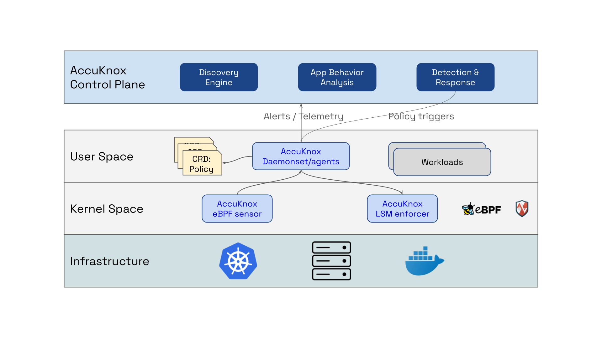
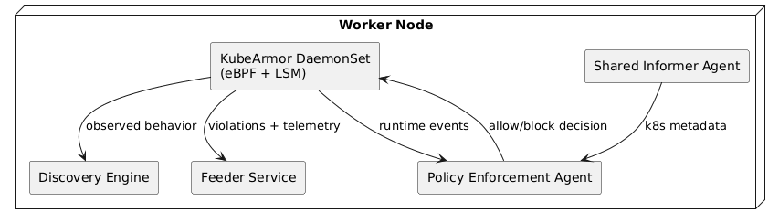

# Runtime Security Architecture

AccuKnox Runtime Security provides runtime protection for Kubernetes workloads by

- Providing **visibility** of the process/file/network/system events and knitting it together with the k8s `namespaces`/`pods`/`containers`.
- Enforcing security controls directly at the **kernel layer**.

It focuses on **process execution**, **file system access**, and **network activity** observed while workloads are running. Runtime security operates during workload execution and provides both kernel-level enforcement as well as detect and respond model where the remedial action is triggered from the control plane.

The diagram shows that runtime security operates at each node, in both kernel and user space.

- The **eBPF sensor** in the **kernel space** gets process, file, network, and other system events.
- The **user space** AccuKnox process knits together this raw information with application and Kubernetes (`namespace`/`pod`/`container`) context before sending the alert/telemetry to the control plane.
- AccuKnox leverages **Linux Security Modules (LSMs)** to enforce rules. E.g., allow only whitelisted process execution. In this case, AccuKnox leverages LSM (specifically `LSM-BPF` and `AppArmor`) to ensure that the corresponding process executions are permitted, and everything else is audited or denied, depending on the configuration (the default mode is **Audit**).

## Deployment Model

Runtime components are deployed using **Kubernetes manifests** or the **AccuKnox Operator** and follow a `DaemonSet` based model to guarantee node-level coverage. Deployment requires Linux kernels that support eBPF (**Kernel >= 4.18**) and **Kubernetes >= 1.17**.

Onboarding AccuKnox Runtime Security introduces **node-local sensors** and enforcers but does not modify ingress, service meshes, or application networking. There is **no inline proxy**, **no sidecar injection**, and **no traffic redirection**. Enforcement is local to each node and does not depend on synchronous control plane connectivity.

!!! note
    Even in the event of a loss of control-plane connectivity, security enforcement will continue to function. Policy and alert synchronization will be handled once connectivity is restored.

## Runtime Resource Allocation and Footprint

### Recommended Runtime Security Resource Quota (Per Node)

| Resource | Request | Limit |
| :--- | :--- | :--- |
| CPU | 100m | 500m |
| Memory | 100 Mi | 500 Mi |

**Continuous runtime monitoring** requires dedicated resources. **Under-provisioning** can result in dropped kernel events, delayed enforcement, or incomplete telemetry.

### Component-Level Runtime Footprint

| Component | CPU | Memory | Deployment |
| :--- | :--- | :--- | :--- |
| KubeArmor DaemonSet | 100m | 100 Mi | Per node |
| Agents Operator | 50m | 50 Mi | Per cluster |
| Discovery Engine | 200m | 200 Mi | Per cluster |
| Shared Informer Agent | 20m | 50 Mi | Per cluster |
| Feeder Service | 50m | 100 Mi | Per cluster |
| Policy Enforcement Agent | 10m | 20 Mi | Per cluster |

## Control Plane Connectivity and Required Ports

All runtime components communicate with the AccuKnox control plane using **outbound-only connections**. The control plane is never part of the execution path.

### Runtime Connectivity and Network Ports 

These ports must be allowed through customer firewalls. **No inbound/ingress access** is required.

| Component | Port | Direction | Purpose |
| :--- | :--- | :--- | :--- |
| Agents Operator | 8081/9090 | Outbound | SPIRE access |
| Agents Operator | 9090 | Outbound | SPIRE health check |
| Shared Informer Agent | 3000 | Outbound | Telemetry to Knox Gateway |
| Policy Enforcement Agent | 443 | Outbound | Policy distribution |

## In-Cluster Runtime Services

Runtime protection inside the cluster is delivered through node-resident services, with `KubeArmor DaemonSet` acting as the foundational component.

`KubeArmor` runs as a DaemonSet on every worker node and functions as a **kernel-level runtime sensor** and enforcer using **eBPF** and **Linux Security Modules**. It enforces process execution, file access, and network controls at execution time. Because enforcement occurs in kernel context, KubeArmor requires advanced capabilities. However, there is **no privileged pod/container requirement**.

The `Policy Enforcement Agent` applies runtime policies locally. The `Discovery Engine` observes live behavior and generates baseline runtime policies. The `Shared Informer Agent` enriches runtime events with Kubernetes metadata. The `Feeder Service` aggregates runtime telemetry and violations and streams them to the control plane. Each component has a single runtime responsibility and does not sit in the application request path.

## Kernel and Privilege Requirements

**Runtime enforcement** depends on kernel-level capabilities and cannot function without them. Hosts must support `eBPF` and `Linux Security Modules`. AccuKnox requires `CAP_SYS_ADMIN` and related capabilities to attach kernel probes, load eBPF programs, and enforce LSM decisions. If these requirements are unmet, runtime security degrades to **visibility-only mode** or becomes non-functional.

!!! note
    AccuKnox does not require privileged containers for Runtime security.

## Runtime Data Flow

**Kernel hooks** capture process, file, and network events during workload execution. Events move from **kernel space** to **user space**, where they are enriched with Kubernetes metadata. The `Policy Enforcement Agent` evaluates events against active runtime policies and immediately applies enforcement actions. Runtime telemetry and violations are aggregated per node and transmitted outbound to the AccuKnox control plane for centralized visibility and alerting.

[This whitepaper provides a detailed technical analysis](https://accuknox.com/wp-content/uploads/Container_Runtime_Security_Tooling.pdf) of AccuKnox Runtime Security, comparing it to other techniques in this space.

## References

- [Container Security tooling comparison](https://accuknox.com/wp-content/uploads/Container_Runtime_Security_Tooling.pdf)
- [AccuKnox Runtime Security Use-cases](https://help.accuknox.com/use-cases/cwpp/#cwpp-use-cases)
- [AccuKnox Enterprise Guide](https://help.accuknox.com/how-to/administrators-guide/)
