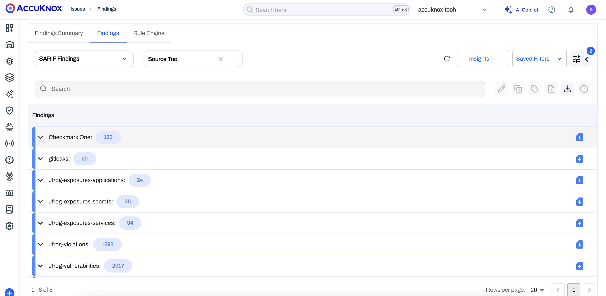

# SARIF Findings

SARIF (Static Analysis Results Interchange Format) is a standard format for the output of static analysis tools. AccuKnox supports importing findings in the SARIF format, allowing you to consolidate security results from various tools into a single platform.

By integrating SARIF findings, you can visualize and manage security issues identified by third-party scanners alongside AccuKnox's native findings. This integration is typically set up using a workflow to ingest the SARIF files.

AccuKnox supports importing SARIF findings from any tool that exports in this standard format. Some common platforms that export SARIF include:

- **Sonatype**
- **Jfrog**
- **Gitleaks**
- **Checkmarx**
- **Any Tool that Export SARIF**

We can import these findings and display them within the AccuKnox platform, providing a unified view of your security posture.

AccuKnox allows you to group and filter SARIF findings based on various attributes such as severity, tool name, and file location. This helps you prioritize and address security issues effectively. You also get the benefit of AccuKnox's advanced analytics, AI assisted remediation, and reporting capabilities to gain insights into your security landscape.
