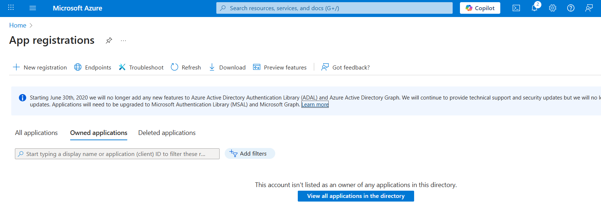
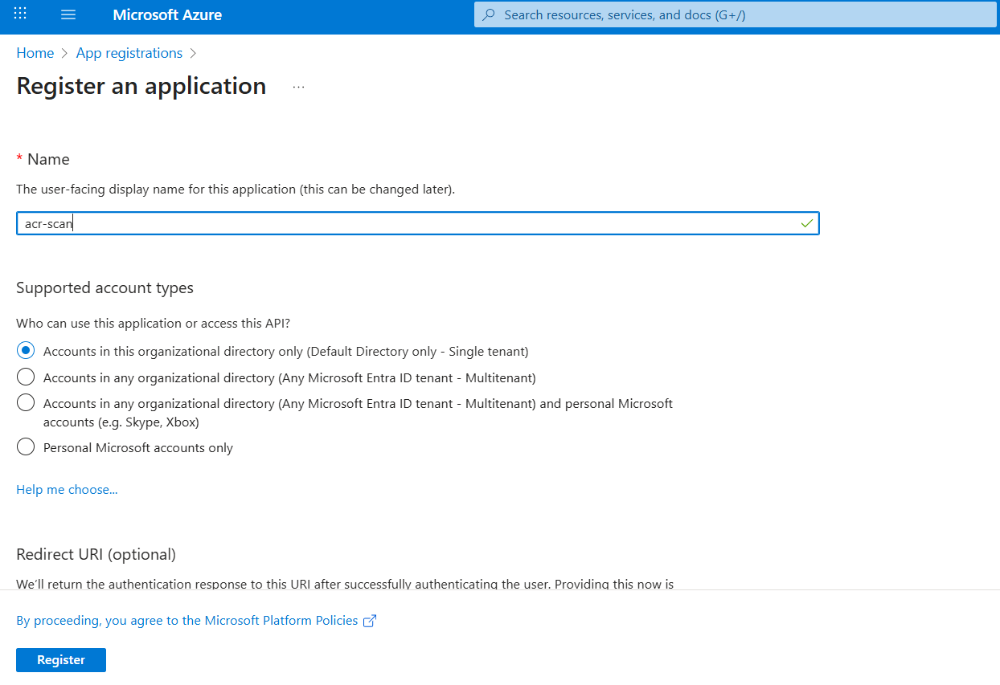
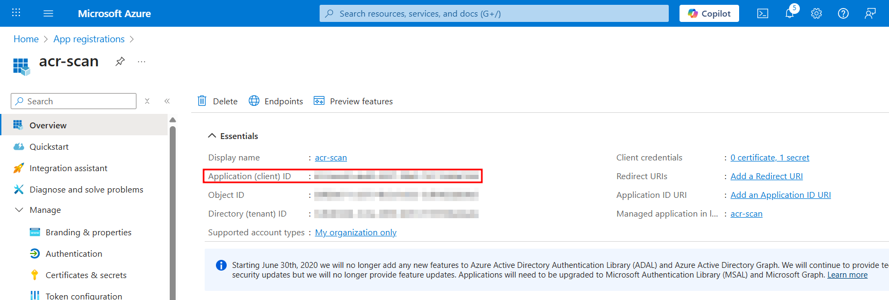
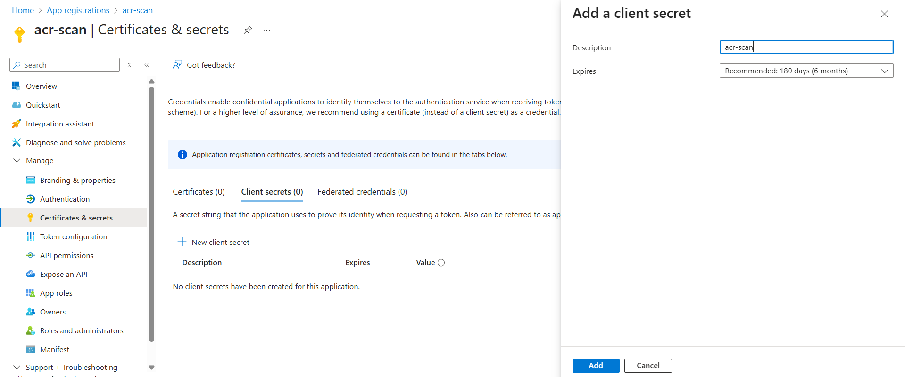
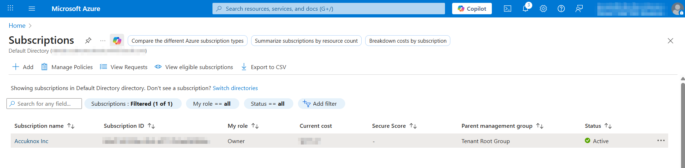
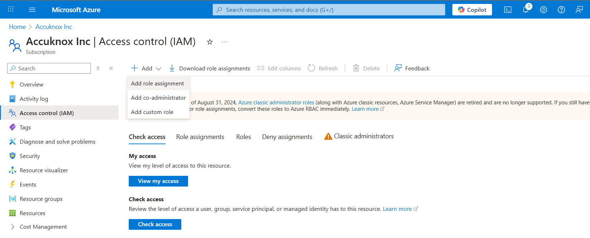
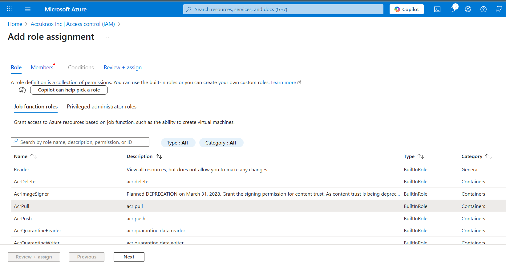
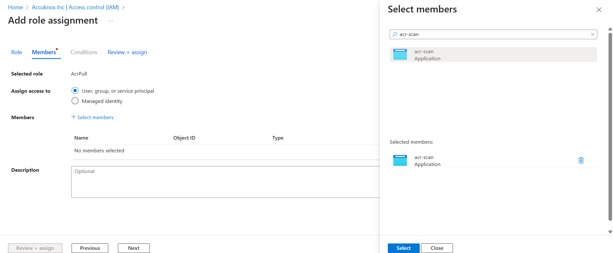
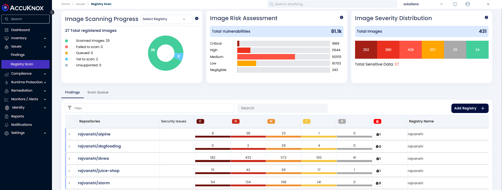
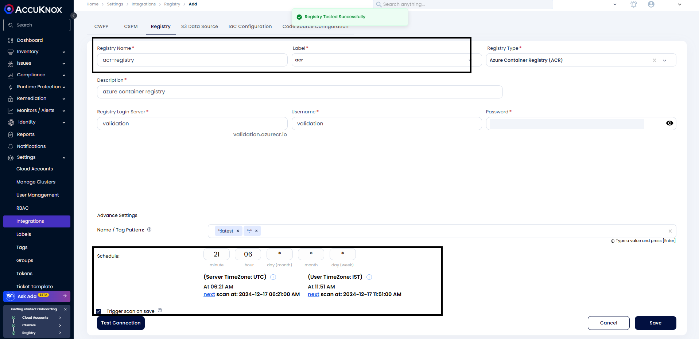

# Azure Container Registry (ACR) Onboarding

AccuKnox CSPM security tool scans images that are present in the onboarded [Azure Container Registry](https://learn.microsoft.com/en-us/azure/container-registry/ "https://learn.microsoft.com/en-us/azure/container-registry/") and can find the risks and vulnerabilities associated with these images. The risks are identified and shown in the scan results. Users will get a comprehensive view of these risks and vulnerabilities in the dashboard along with their remediation.

## **Steps to generate credentials for onboarding ACR**

The credentials for onboarding ACR can be created from either the Azure Portal or using the azure CLI tool:

### **Via Azure Portal**

**Step 1**: Create an App Registration

Browse to **Entra ID** > **App registrations** and click on **New Registration**



Provide a Name for the App Registration and click on **Register** 



Copy the **Application (client) ID** after creation, this will be the username for connecting the registry with AccuKnox.



**Step 2**: Create Client Secret

1. Browse to **Entra ID** > **App registrations**, then select your application.
2. Select **Certificates & secrets**.
3. Select **Client secrets**, and then select **New client secret**.
4. Provide a description of the secret, and a duration.
5. Select **Add**.



Copy the **client secret value**, this is used as the password for connecting to the registry.

**Step 3**: Assign Permissions

Select the subscription where the ACR is present. 

!!! note
    If only one registry needs to be scanned, the Role Assignment can also be added in the IAM blade of the Container Registry resource instead of the subscription



Navigate to IAM and select **Add role assignment**



Select the **ACRPull role** and click on **Next**



Under Members, click on **Select Members** and **Select** the application registration that was created



Click on **Next** and **Assign** the role.

The Application (client) ID and the client secret value are used as the Username and Password respectively for onboarding registries on AccuKnox

### **Via azure CLI**
The following script can be used to create a service principal and assign it the acrpull permissions for a specific registry:

```bash
#!/bin/bash
# This script requires Azure CLI version 2.25.0 or later. Check version with `az --version`.

# Modify for your environment.
# ACR_NAME: The name of your Azure Container Registry
# SERVICE_PRINCIPAL_NAME: Must be unique within your AD tenant
ACR_NAME=$containerRegistry
SERVICE_PRINCIPAL_NAME=$servicePrincipal

# Obtain the full registry ID
ACR_REGISTRY_ID=$(az acr show --name $ACR_NAME --query "id" --output tsv)

# Create the service principal with rights scoped to the registry.
# acrpull:     pull only
PASSWORD=$(az ad sp create-for-rbac --name $SERVICE_PRINCIPAL_NAME --scopes $ACR_REGISTRY_ID --role acrpull --query "password" --output tsv)
USER_NAME=$(az ad sp list --display-name $SERVICE_PRINCIPAL_NAME --query "[].appId" --output tsv)

# Output the service principal's credentials; use these in AccuKnox to authenticate
echo "Service principal ID(User Name): $USER_NAME"
echo "Service principal password: $PASSWORD"
```
!!! note
    In the script, replace `$containerRegistry` with the registry name and `$servicePrincipal` with the name you would like to use for the Service Principal before execution.

The output of the script provides the Username and Password to be used for connecting the registry with AccuKnox.

## **Steps to Onboard ACR Registry on AccuKnox**

**Step 1:** In the **AccuKnox dashboard**, under Issues, click on "**Registry Scan**"

- Alternatively, you can go to "**Settings → Integration → Registry Scan**"

Now, click on "**Add Registry"**



**Step 2:** Enter any Registry Name and Description. Select Registry Type as ACR and paste the Login Server, Username, and Password that was copied.

Provide the **Tag pattern** and schedule a time( using the cron expression) for the scanning. If you need to trigger the scan after saving, click the **"Trigger scan on save"** checkbox.

**Step 3:** After providing all the information, click on **"Test Connection"**, it should show **"Registry Tested Successfully"**.

Now, click on **Save**.



## Configure Advanced Settings

### Image Updated Within Last

Choose one of the following options:

  - **X Days**: Scans only images updated within the last X days.

  - **All**: Scans all images, regardless of the update time.

### Image Pulled Within Last

Choose one of the following options:

  - **X Days**: Scans only images pulled within the last X days.

  - **All**: Scans all images, regardless of the pull time.


### **Name/Tag Pattern:**

Specify patterns to include or exclude images for scanning. Use the `-` symbol to explicitly exclude patterns.

By default, images are excluded unless explicitly included through patterns.

To exclude specific images, use the `-` symbol. For example: - To exclude `cwpp/ubuntu:v1`, use the pattern `-*:v1`. - To include `cwpp/ubuntu:latest`, specify a pattern like `*:latest`.

**Note**: Only images matching the pattern will be scanned. For instance, using `*:latest` ensures only images with the latest tags are scanned.


### Schedule and Certificate

Set the scan schedule using a CRON expression. For example: - **CRON Expression**: `18 minute 07 hour * day (month) * month * day (week)`.


Toggle **Trigger Scan on Save** to initiate the scan for the first time without waiting for the scheduled time.

**Step 4:** After saving the registry, the scan will start based on the scheduled time, if the Trigger scan on save is checked the scan will start right after save. After saving the scan user will be redirected to **Settings** -> **Integrations** -> **Registry**. Here, we can see the list of onboarded registries and their details.


Alternatively, you can click on "**View Registry Scan**" from the list view and this will redirect to **Issues → Registry Scan**

Once the scanning is completed, we can see the scan results


Under **"Findings"**, you can find the scanned registry.

To view the details of your registry, you can use filters such as **"registry_type"**, and then select the **"acr"** registry you can also use the filter **"registry_name"** and provide the name of your registry.


By clicking on the repositories, we can get more details about the scan results.


