# Onboarding Azure Organization

Managing security across multiple Azure subscriptions is complex. Onboarding your **Azure Organization** allows for centralized visibility and consistent policy enforcement across all subscriptions.

## 1. Configurations

### AccuKnox Side Configuration (One-time Setup)

!!! note
    This section describes the configuration required on the AccuKnox management side (or the service provider side) to enable multi-tenant access.

1.  **Navigate to Microsoft Azure Portal**:
    Go to [portal.azure.com](https://portal.azure.com/).

2.  **Create App Registration**:
    - Search for **App registrations** in the search bar.
      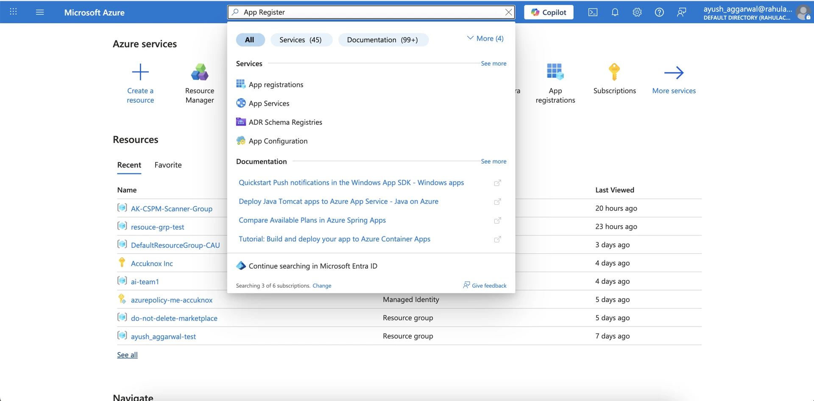
    - Click **New registration**.
      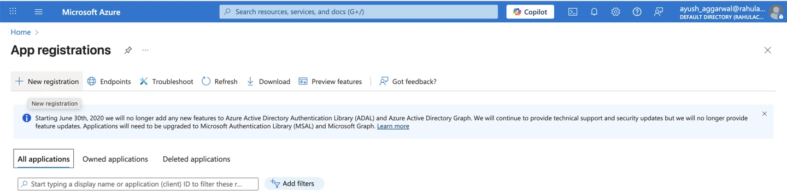
    - Enter a **Name** for the application.
    - Under **Supported account types**, select:
      > Accounts in any organizational directory (Any Microsoft Entra ID tenant - Multitenant)
    - Click **Register**.
      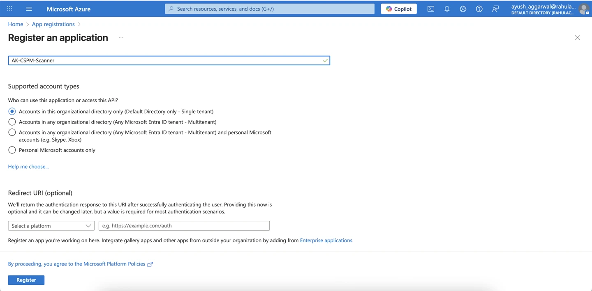

3.  **Create a Certificate & Secret**:
    - Within the newly created app, go to **Certificates & secrets**.
    - Click **New client secret**.
      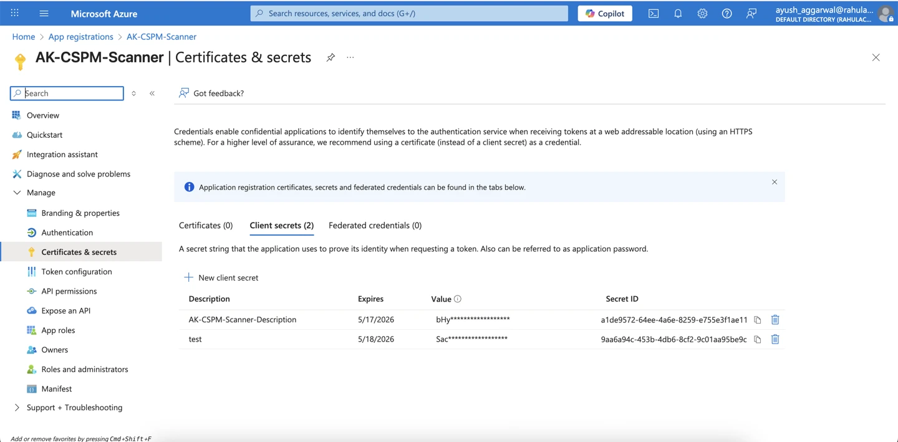
    - Add a description and expiry, then click **Add**.
    - **Save the Value** immediately (it will be hidden later).

4.  **Create Resource Group & Assign Role**:
    - Search for and create a new **Resource Group**.
      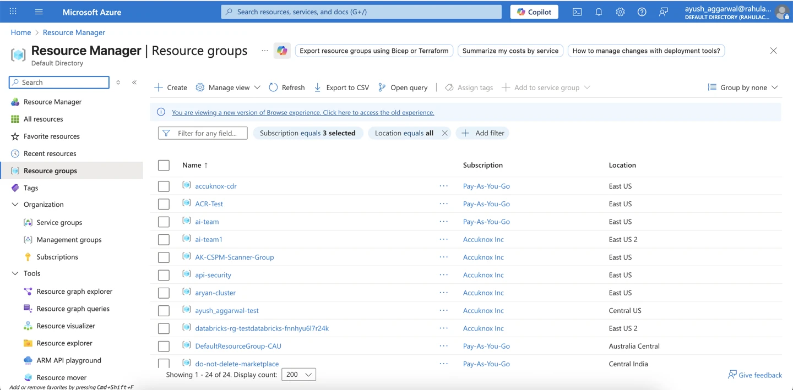
    - Go to **Access control (IAM)** within the Resource Group.
    - Click **Add** > **Add role assignment**.
      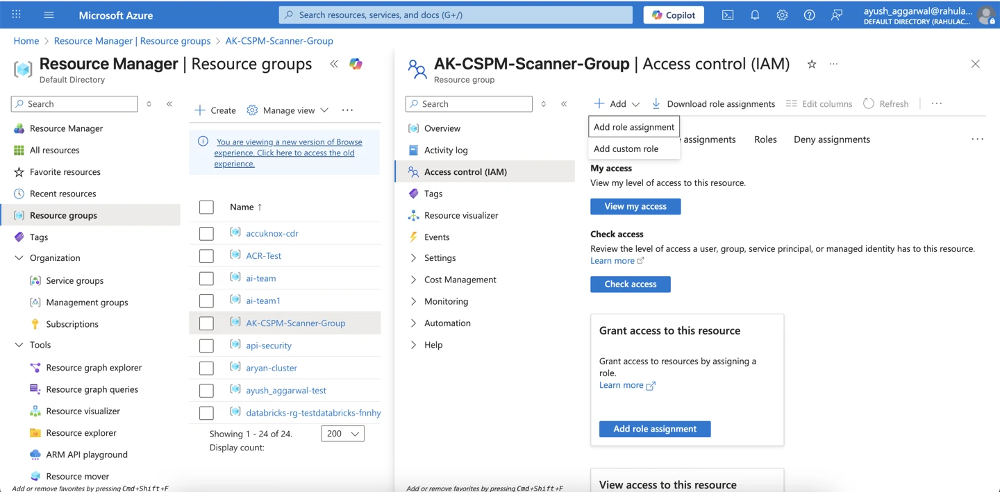
    - Select the Role: **Security Reader**.
      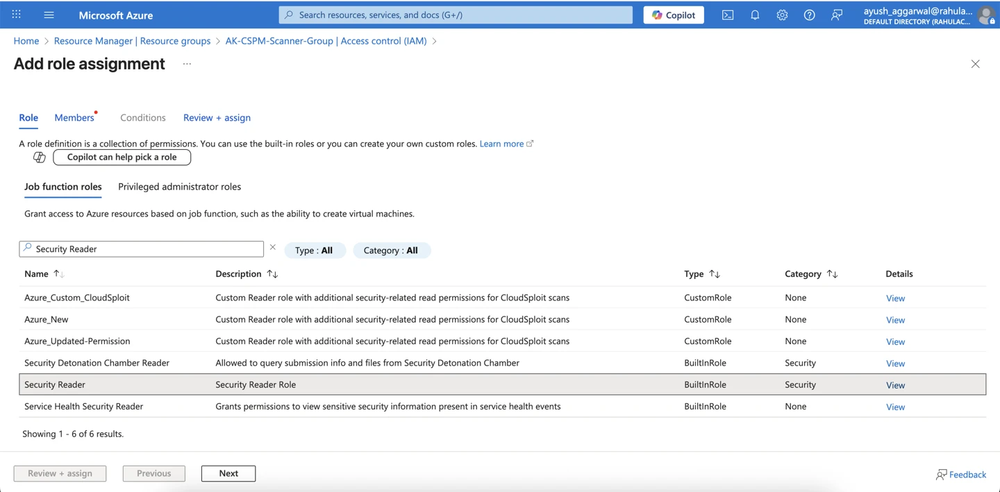
    - Assign access to **User, group, or service principal**.
    - Select the **App created above** as a member.
    - Review and assign.
      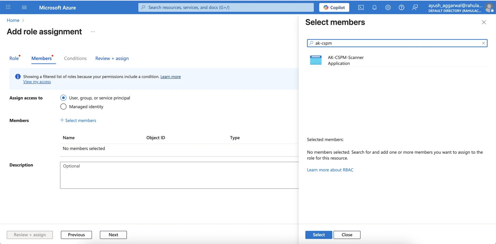

5.  **Note Down Required IDs**:
    - **Object ID** of the App
    - **Secret Value** of the App
    - **Tenant ID** of AccuKnox (Directory ID)

---

### User-Side Configuration

AccuKnox provides a flexible way to selectively onboard your Azure environment. You can choose to onboard specific Management Groups and Subscriptions or onboard everything while excluding specific parts.

#### 1. Enter Organization Details

In the AccuKnox portal, you will be asked to provide the following details to generate the onboarding script:

- **Management Group ID (`management_group_id`)**: The ID of the root or parent management group you want to onboard.
- **Context Subscription ID (`context_subscription_id`)**: The ID of the subscription where the Lighthouse definition will be stored (usually the management subscription).

#### 2. Select Onboarding Mode

Choose the mode that best fits your organizational structure:

=== "Include Mode"

    **Best for:** Onboarding specific departments, staging environments, or a subset of your organization.

    *   **Included Management Groups (`included_management_group_ids`)**: [**Mandatory**]
        Specify the list of Management Group IDs you want to onboard. All subscriptions within these groups will be included.
    *   **Include Extra Subscriptions (`include_extra_subscription_ids`)**: [**Optional**]
        Specify individual Subscription IDs that are *outside* the selected Management Groups but should still be onboarded.
    *   **Exclude Subscriptions (`excluded_subscription_ids`)**: [**Optional**]
        Specify individual Subscription IDs that are *inside* the selected Management Groups but should NOT be onboarded.

=== "Exclude Mode"

    **Best for:** Onboarding the entire organization while omitting specific sensitive or sandbox environments.

    *   **Excluded Management Groups (`excluded_management_groups`)**: [**Mandatory**]
        Specify the list of Management Group IDs you want to **skip**. All other Management Groups under the root will be onboarded.
    *   **Excluded Subscriptions (`excluded_subscription_ids`)**: [**Optional**]
        Specify individual Subscription IDs that you want to **skip**, even if their Management Group is being onboarded.

#### 3. Search and Add IDs

Use the search bar in the portal to find and select the Management Groups and Subscriptions you want to include or exclude based on the mode selected above.

#### 4. Generate & Run Terraform Script

Once you have configured the parameters above, click **Generate Terraform**.

1.  **Download** the generated Terraform script.
2.  Open your terminal and execute the following commands:

    **Log in to Azure CLI:**

    ```bash
    az login
    ```

    **Initialize Terraform:**

    ```bash
    terraform init
    ```

    **Apply Configuration:**

    ```bash
    terraform apply
    ```

After a successful run, the user will be able to authorize and view their accounts on the AccuKnox Portal.

---

## 2. Auto-fetch New Subscriptions

When a user creates a **New Subscription**:

1.  Move the subscription to the onboarded **Management Group** (`management_group_id`).
2.  Go to the Subscription in the Azure Portal and search for **Resource providers**.
   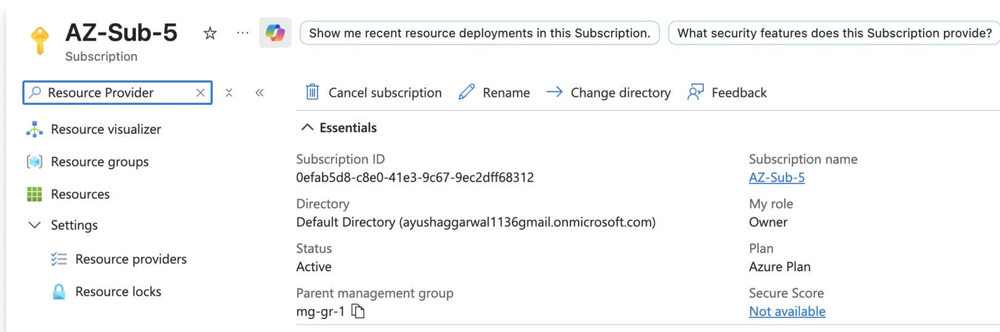
3.  Ensure the following providers are enabled:
    - `Microsoft.ManagedServices`
    - `Microsoft.PolicyInsights`

After approximately **30 minutes**, the subscription will be automatically delegated to AccuKnox, and resources will be queried.


- **User's Azure Account**
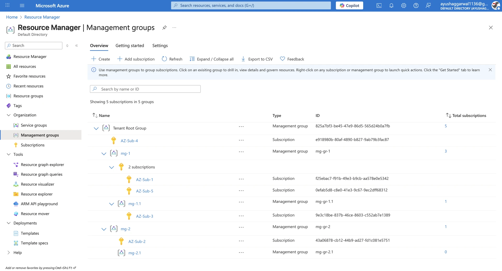

- **AccuKnox Azure Account**
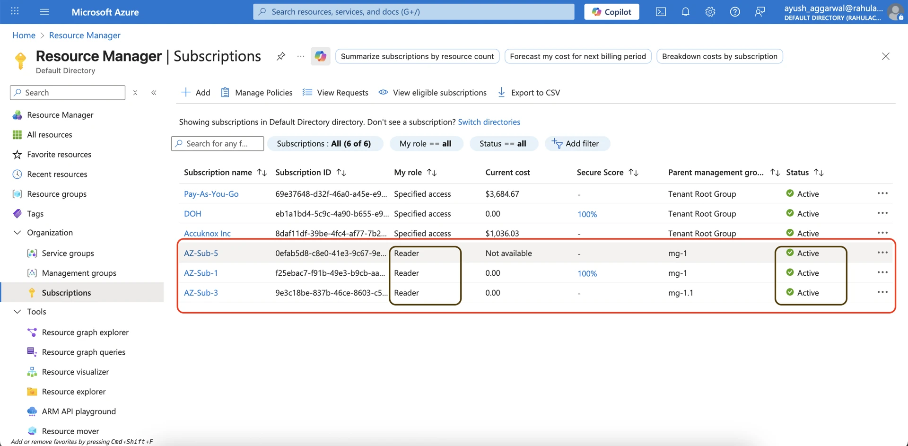