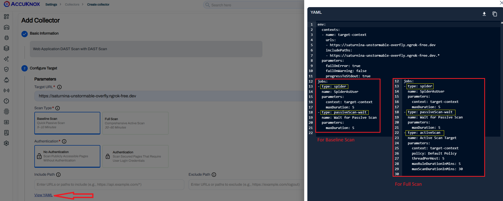
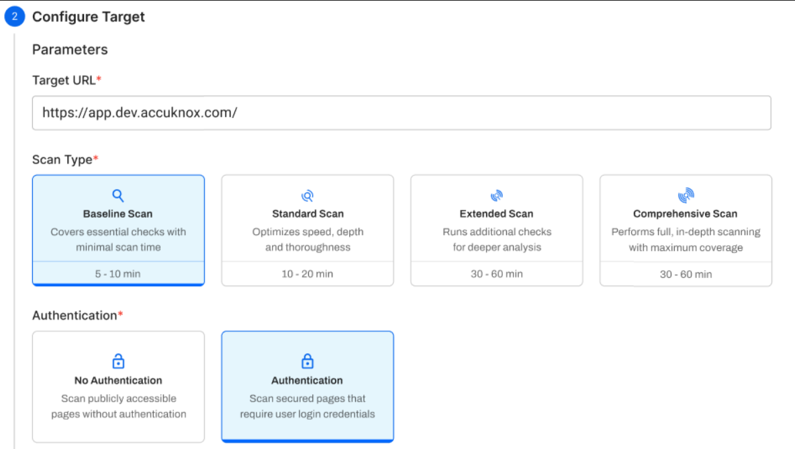

# DAST Baseline vs. Full Scan

AccuKnox provides two distinct modes for Dynamic Application Security Testing (DAST) to balance the need for speed with the depth of security coverage. Below is a breakdown of how these scans differ and when to use them.

---

## Overview of Differences

| Feature             | Baseline Scan                           | Full Scan                                    |
| ------------------- | --------------------------------------- | -------------------------------------------- |
| **Primary Goal**    | Quick security "health check"           | Comprehensive security audit                 |
| **Scan Mode**       | **Passive only** (Safe & non-intrusive) | **Active & Passive** (Thorough & aggressive) |
| **Spider Duration** | Limited (Fixed time window)             | Unlimited (Comprehensive crawling)           |
| **Estimated Time**  | **5 – 10 Minutes**                      | **30 – 60+ Minutes**                         |
| **Risk to App**     | **None.** Safe for live production      | **High.** May impact data or stability       |
| **Usage**           | Every build or daily CI/CD gates        | Weekly or pre-release deep-dives             |

---

## Baseline Scan

The **Baseline Scan** is designed for high-frequency testing where speed and safety are paramount. It is a non-invasive, time-limited passive scan.

- **Mechanism:** It crawls the application using a spider for a fixed duration. It only analyzes the existing traffic and responses without sending malicious payloads.
- **Vulnerability Focus:** Identifies "low-hanging fruit" and misconfigurations, such as missing security headers (CSP, X-Frame-Options), cookie security issues, and anti-CSRF token absence.

!!! tip "Best Used For"
    Frequent, fast checks within a CI/CD pipeline to ensure new builds don't introduce basic security regressions.

??? abstract "Passive Security Baseline Audit Details"
    This scan is designed to provide a rapid, non-intrusive security assessment of a web application. It identifies common security misconfigurations and missing best practices without performing active "attacks" or injecting payloads into the target system.

    ### Key Scanning Phases
    * **Link Discovery (Crawling)**
      The engine explores the target application for a specified duration (defaulting to 1 minute) to map out all accessible URLs, scripts, and resources.
    * **Passive Analysis**
      While crawling, the engine monitors every request and response. it analyzes the headers, cookies, and HTML body to identify vulnerabilities.
    * **Reporting Levels**
      Rules are categorized by severity, allowing for the promotion of warnings to failures or the suppression of specific non-applicable alerts.

    ### What is Audited?
    The scan exhaustively checks for "low-hanging fruit" and configuration issues.

    1. **Security Headers** including `Content-Security-Policy`, `X-Frame-Options` (Clickjacking protection), and `X-Content-Type-Options`.
    2. **Cookie Security** detection of missing `Secure`, `HttpOnly`, or `SameSite` flags on session cookies.
    3. **Information Disclosure** of private IP addresses, sensitive file paths, or server version strings leaked in headers or error messages.
    4. **Form Security** identification of insecure password fields or auto-complete settings on sensitive inputs.
    5. **Application Errors** via detection of raw stack traces or internal server error details that could aid an attacker.

    ### Characteristics
    * **Non-Invasive** - Safe to run against production environments as it does not attempt to modify data or exploit flaws.
    * **High Speed** - Optimized for CI/CD pipelines to provide immediate feedback on the security posture of new builds.

## Full Scan

The **Full Scan** is a deep-dive assessment meant for thorough testing in environments where performance impact is acceptable.

- **Mechanism:** It runs a spider with no time limit to map the entire application, followed by a complete **Active Scan**. This actively "attacks" the target by sending harmful requests to probe for deep vulnerabilities.
- **Vulnerability Focus:** Finds a much wider range of complex issues that require active payloads, such as **SQL Injection**, **Cross-Site Scripting (XSS)**, and Broken Access Control.

!!! tip "Best Used For"
    Scheduled deep audits (e.g., weekly) in staging or development environments before a major release.

??? abstract "Advanced Active Penetration Testing Rules Details"
    This scan represents a deep-dive security assessment. Unlike passive auditing, this engine actively interacts with the application by sending malicious payloads to discover exploitable vulnerabilities. It mimics the behavior of a real-world attacker to identify flaws in the application logic and backend.

    ### Core Attack Categories
    The engine utilizes a comprehensive library of rules to test for several vulnerability classes.

    #### 1. Injection Vulnerabilities
    * **SQL/NoSQL Injection** - Probing input fields to see if backend database queries can be manipulated.
    * **OS Command Injection** - Attempting to execute unauthorized commands on the host operating system.
    * **Server-Side Template Injection (SSTI)** - Testing if web templates can be exploited to gain remote code execution.
    * **XML External Entity (XXE)** - Identifying flaws in XML parsers that allow for file retrieval or SSRF.

    #### 2. Client-Side Attacks
    * **Cross-Site Scripting (XSS)** - Injecting scripts into both Reflected (URL parameters) and Stored (Database-backed) inputs to compromise user sessions.
    * **Cross-Site Request Forgery (CSRF)** - Checking if sensitive actions can be performed without proper token validation.

    #### 3. Broken Access Control & Logic
    * **Path Traversal** - Attempting to access restricted files on the server (e.g., `/etc/passwd`).
    * **Remote File Inclusion (RFI)** - Testing if the application can be forced to load malicious code from an external server.
    * **Server-Side Request Forgery (SSRF)** - Exploiting the server to make unauthorized requests to internal infrastructure.

    #### 4. Infrastructure & Server Configuration
    * **Buffer Overflows** - Sending excessively large data strings to identify memory corruption vulnerabilities.
    * **Insecure File Uploads** - Testing if the server accepts executable files in place of standard documents/images.
    * **Cloud Metadata Leakage** - Attempting to extract sensitive credentials from cloud instance metadata services (AWS/Azure/GCP).

    ### Scanning Sophistication
    * **Payload Variation** - Each input is tested with hundreds of variations to bypass basic WAF filters.
    * **Context Awareness** - The engine adapts its attack patterns based on the technology stack detected (e.g., tailoring attacks specifically for Java, PHP, or .NET environments).
    * **Severity Rating** - Vulnerabilities are ranked by impact, providing a clear roadmap for remediation based on the risk to the business.

    ### Characteristics
    * **Active Interaction** - This scan sends "attack" traffic; it is recommended for use in staging or development environments.
    * **Thoroughness** - Provides the highest level of assurance regarding the exploitability of a web application.

## New Scan Categories Coming Soon

In the near future, we will be introducing additional scan categories to provide even more tailored security assessments:

