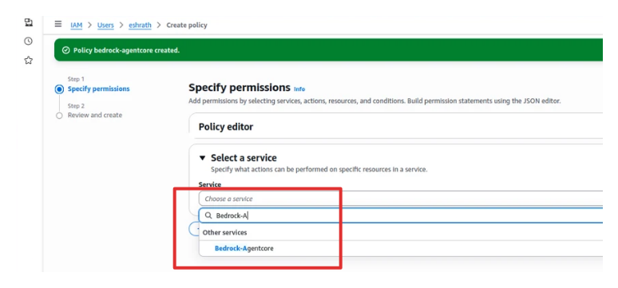
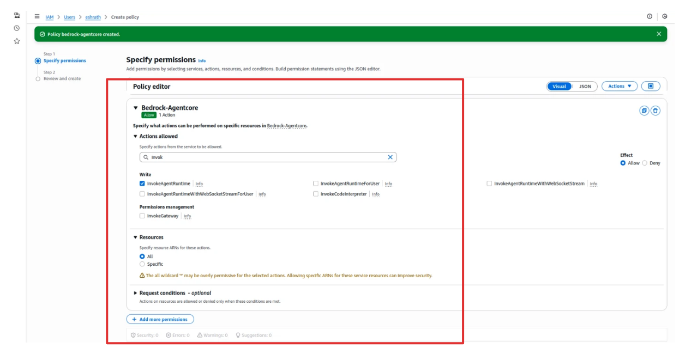

# Integrate Bedrock-Agentcore with AccuKnox for AI Asset Scanning

## Permissions for AI Asset Scanning (AWS)

To scan AI assets in AWS, you must configure an IAM User with specific permissions.

### Managed Policies (Required)

Attach the following AWS managed policies to the IAM User:

* `ReadOnly` (AWS managed -- job function)
* `SecurityAudit` (AWS managed -- job function)

### Inline Policy Permissions

Create an inline policy with the following permissions:

| Service | Actions |
| :--- | :--- |
| **AWS Bedrock** | `bedrock:InvokeModel` `bedrock:ListImportedModels` `bedrock:ListModelInvocationJobs` |
| **AWS SageMaker** | `sagemaker:InvokeEndpoint` |
| **Bedrock-Agentcore** | `bedrock-agentcore:InvokeAgentRuntime` |

## Steps to Configure IAM User for AI Asset Scanning (AWS)

1. Navigate to **IAM** > **Users** > **Create User**.
2. Select the AWS managed policies **ReadOnlyAccess** and **SecurityAudit** to attach to the user.
3. Go to **Add Permissions** > **Create inline policy**.
    * For **AgentCore Permissions**: Select **Bedrock-Agentcore**, allow **InvokeAgentRuntime**, and choose **All** resources.

    
    

    * For **SageMaker Permissions**: Select **SageMaker**, allow **InvokeEndpoint**, and choose **All** resources.
    * For **Bedrock Permissions**: Select **Bedrock**, allow **InvokeModel**, **ListImportedModels**, and **ListModelInvocationJobs**, and choose **All** resources.
4. Review and create the policy to attach it to the IAM user.

## Onboarding

1. To onboard a Cloud Account, navigate to **Settings** > **Cloud Accounts**.
2. On the Cloud Account page, select **Add Account**.
3. Select the **AWS** option.
4. In the next screen, select the relevant labels and tags from the dropdown menu.
5. After providing labels and tags, click **Next**. Provide the AWS account's **Access Key** and **Secret Access Key**, and select the **Region** of the AWS account.
6. The AWS account is added to AccuKnox using the Access Key method. You can view the onboarded cloud account by navigating to **Settings** > **Cloud Accounts**.