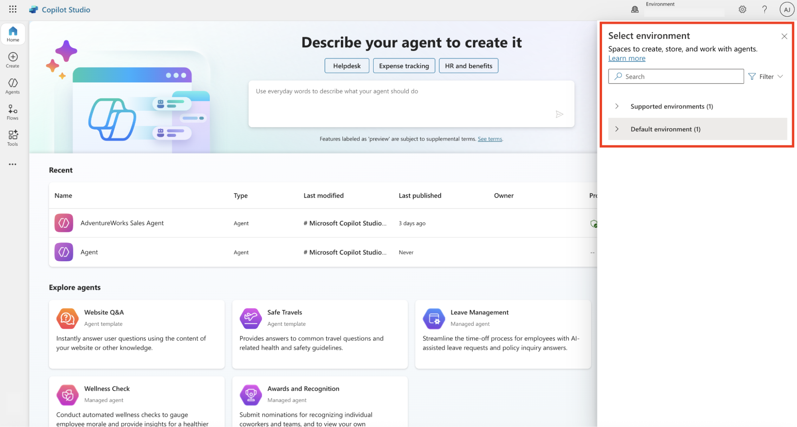

# Integration with Copilot Studio (CP Studio)

## 1. Azure Portal Configuration

### 1.1 Register the Application

- Log in to the Azure Portal.
- Navigate to Microsoft Entra ID → App registrations.
- Register a new application.
- Capture and save the following details:
    - Application (Client) ID
    - Tenant ID
    - Client Secret (created under Certificates & secrets)

### 1.2 Configure API Permissions

- Go to API permissions for the registered application.
- Add permissions for Microsoft Graph.
- Add the following Application permissions:
    - Application.Read.All
    - AuditLog.Read.All
    - AuditLogsQuery-CRM.Read.All
    - AuditLogsQuery.Read.All

### 1.3 Grant Admin Consent

- After adding the permissions, click Grant admin consent.
- Confirm that all permissions show a Granted status.

## 2. Power Platform Configuration

### 2.1 Add Application User

- Open the Power Platform Admin Center.
- Select the required Environment.
- Navigate to: Settings → Users + Permissions → Application users
- Click New app user.
- Select the Azure application created earlier.

### 2.2 Assign Security Role

- Assign the Service Reader role (or another required role based on access needs).
- Save the changes.

## 3. Copilot Studio (CP Studio) Configuration

### 3.1 Get Environment URL

- Open Copilot Studio.
- Navigate to Settings → Session details.
- Copy the Environment URL.

### 3.2 Integrate with AccuKnox

- Open the AccuKnox Console.
- Enter the following details to finalize the integration:
    - **Application (Client) ID**
    - **Client Secret**
    - **Tenant ID**
    - **Environment URL**
- Save the configuration to complete the integration process.
