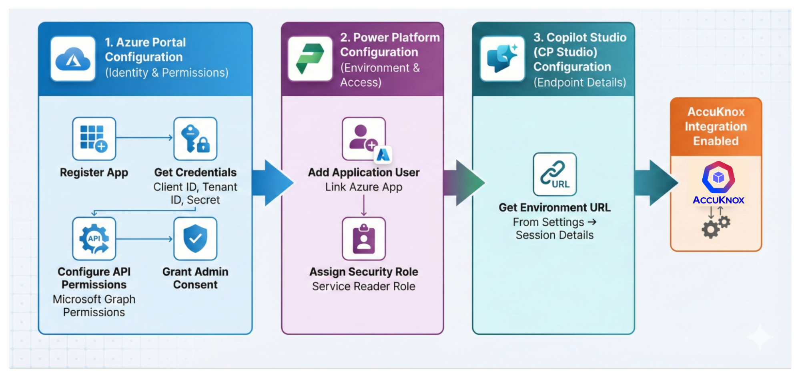
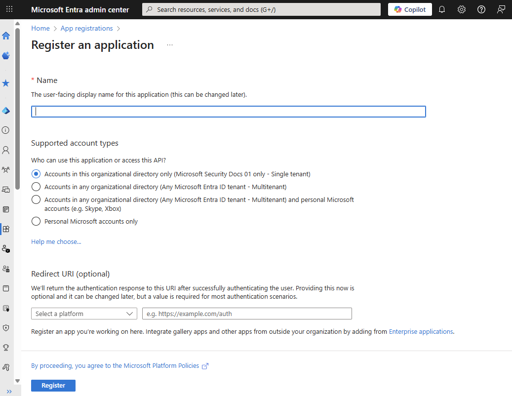
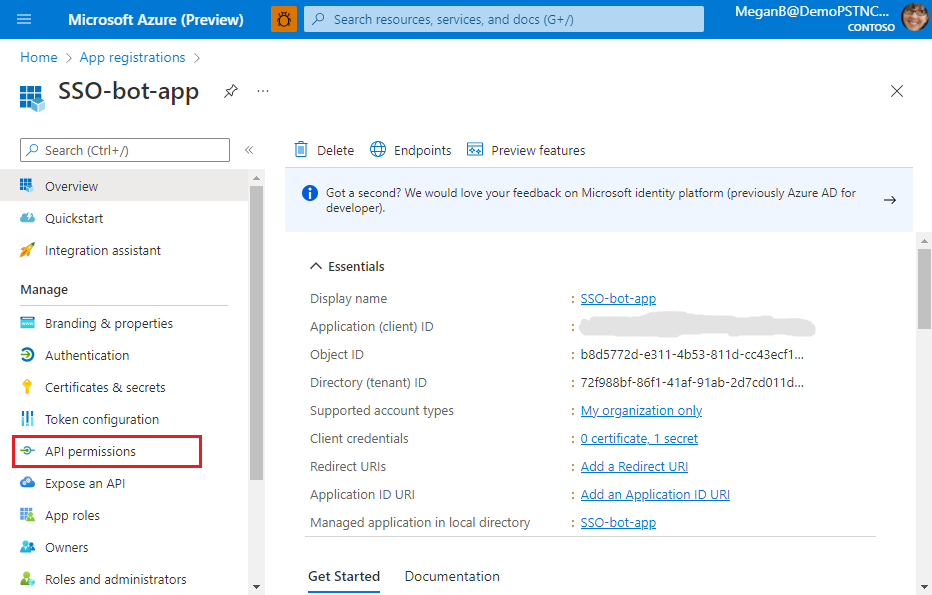
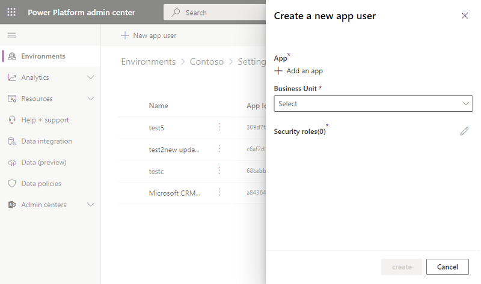

# Integration with Copilot Studio (CP Studio)

## 1. Azure Portal Configuration

### 1.1 Register the Application

- Log in to the Azure Portal.
- Navigate to Microsoft Entra ID → App registrations.
- Register a new application.
- Capture and save the following details:
    - Application (Client) ID
    - Tenant ID
    - Client Secret (created under Certificates & secrets)

### 1.2 Configure API Permissions

- Go to API permissions for the registered application.
- Add permissions for Microsoft Graph.

!!! note "Detailed Steps"
    Refer to [Azure AI/ML Onboarding](https://help.accuknox.com/how-to/azure-onboarding/#rapid-onboarding-via-azure) **Steps 1 to 8** here for a more detailed guide with screenshots.

- **After adding the permissions as per above until step 8**, add few more Application permissions:
    - Application.Read.All
    - AuditLog.Read.All
    - AuditLogsQuery-CRM.Read.All
    - AuditLogsQuery.Read.All

- Now, select `Grant Admin Consent` for Default Directory and say Yes to confirm.

### 1.3 Grant Admin Consent

- After adding the permissions, click Grant admin consent.
- Confirm that all permissions show a Granted status.

## 2. Power Platform Configuration

### 2.1 Add Application User

- Open the Power Platform Admin Center.
- Select the required Environment.
- Navigate to: Settings → Users + Permissions → Application users
- Click New app user.
- Select the Azure application created earlier.

### 2.2 Assign Security Role

- Assign the Service Reader role (or another required role based on access needs).
- Save the changes.

!!! note "Detailed Steps"
    Once the above is done complete **Steps 10 to 17** from [Azure AI/ML Onboarding](https://help.accuknox.com/how-to/azure-onboarding/#rapid-onboarding-via-azure)  to complete the Copilot studio integration.