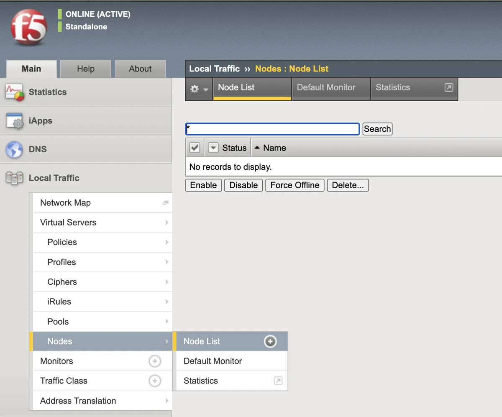
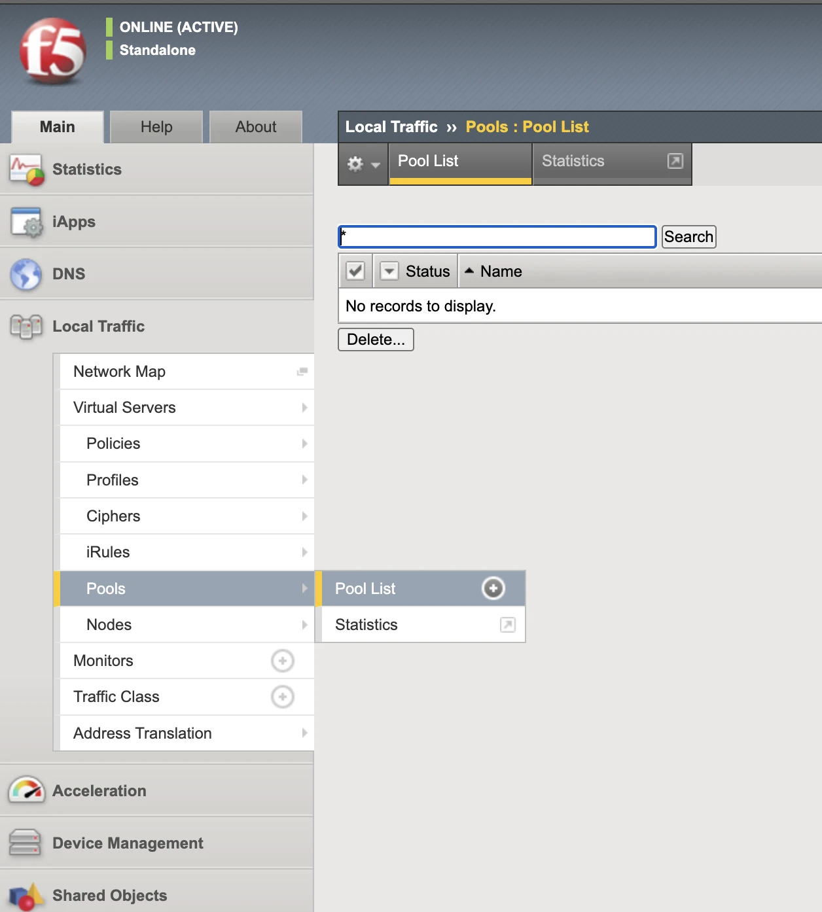
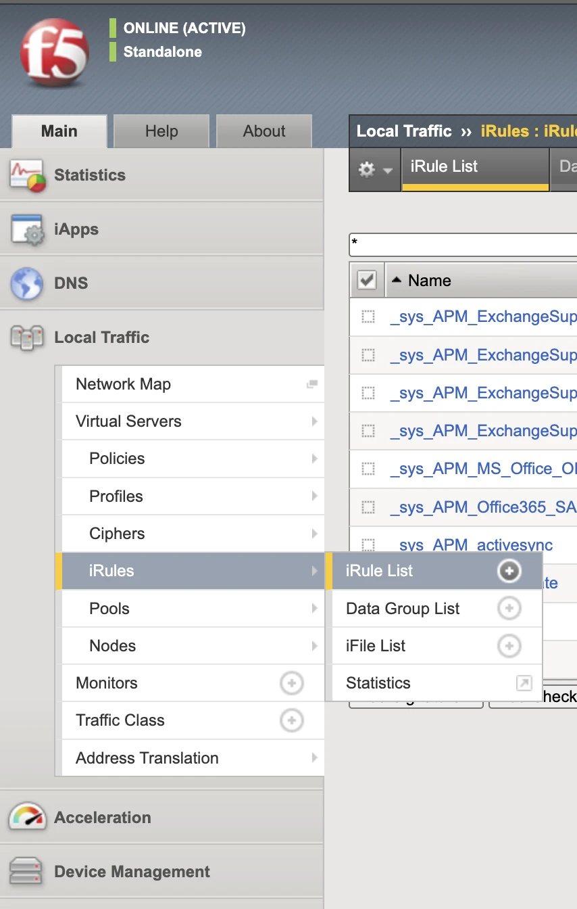

# F5 Big IP Integration with AccuKnox API Security

This guide describes how to integrate F5 Big IP with AccuKnox API Security for API security monitoring.

## Prerequisites

- F5 Big IP instance

## Steps

### 1. F5 Node Setup

1. Inside left nav bar go to **Local Traffic -> Nodes -> Node List**.

    

2. Create a new node in your F5 dashboard. Use the IP and port of the AccuKnox API Security instance as the Address.

### 2. F5 Pool Setup

1. Inside left nav bar go to **Local Traffic -> Pools -> Pool List**.

    

2. Create a new pool named `sentryflow` in your F5 dashboard.
    - **Address**: Use the IP of the AccuKnox API Security instance.
    - **Service Port**: `30002`

### 3. iRule Setup

1. Inside left nav bar go to **Local Traffic -> iRules -> iRule List**.

    

2. Create a new iRule with the following TCL script:

```tcl
when RULE_INIT {
    set static::delimiter "__"
    set static::hsl_start "${static::delimiter}HSL_START${static::delimiter}"
    set static::request_header_start "${static::delimiter}REQHS${static::delimiter}"
    set static::request_header_end "${static::delimiter}REQHE${static::delimiter}"
    set static::header_name "${static::delimiter}HEAN${static::delimiter}"
    set static::header_value "${static::delimiter}HEAV${static::delimiter}"
    set static::response_header_start "${static::delimiter}RESPHS${static::delimiter}"
    set static::response_header_end "${static::delimiter}RESPHE${static::delimiter}"
    set static::max_collect_len 10000
    set static::request_payload "${static::delimiter}REQPS${static::delimiter}"
    set static::response_payload "${static::delimiter}REQPE${static::delimiter}"
    set static::hsl_end "${static::delimiter}HSL_END${static::delimiter}"
}
when CLIENT_ACCEPTED {
   set hsl [HSL::open -proto TCP -pool sentryflow]
    # initialize per-connection variables
    set reqHeaderString ""
    set resHeaderString ""
    set request_payload ""
    set response_payload ""
    set forwarded_data 0
    set protocol ""
    set request_time 0
    set response_time 0
}
when HTTP_REQUEST {
    set request_time [clock clicks -milliseconds]
    # Build request header blob (simple, safer escaping)
    set reqHeaderString "${static::request_header_start}"
    foreach aHeader [HTTP::header names] {
        if { [string tolower $aHeader] == "content-type" } {
            set contentTypeHeaderValue [HTTP::header value $aHeader]
        }
        set lwcasekey [string tolower $aHeader]
        # escape only double quotes (safe)
        set safe_key  [string map {"\"" "\\\""} $lwcasekey]
        set raw_val   [HTTP::header value $aHeader]
        set safe_val  [string map {"\"" "\\\""} $raw_val]
        append reqHeaderString "${static::header_name}${safe_key}${static::header_value}${safe_val}"
    }
    append reqHeaderString ${static::request_header_end}
    # Save metadata
    set path                 [HTTP::path -normalized]
    set method               [HTTP::method]
    set client_addr          [IP::client_addr]
    set client_port          [TCP::client_port]
    set dest_addr            [IP::local_addr]
    set dest_port            [TCP::local_port]
    set query                [HTTP::query]
    set request_payload      ""; # will be set in HTTP_REQUEST_DATA
    set scheme ""
    if { [SSL::mode] == 1 } {
        set scheme "https"
    } else {
        set scheme "http"
    }
    if { [HTTP::header exists "scheme"] == 0 } {
        HTTP::header insert "scheme" ${scheme}
    }
    if { [HTTP::header exists "path"] == 0 } {
        HTTP::header insert "path" ${path}
    }
    if { [HTTP::header exists "method"] == 0 } {
        HTTP::header insert "method" ${method}
    }
    if { [HTTP::header exists "query"] == 0 } {
        HTTP::header insert "query" ${query}
    }
    if { [HTTP::version] eq "2" } {
        set protocol "HTTP/2"
    } else {
        set protocol "HTTP/[HTTP::version]"
    }
}
when HTTP_REQUEST_DATA {
    if { [HTTP::payload length] > 0 } {
        set capture_length [HTTP::payload length]
        if { $capture_length > $static::max_collect_len } {
            set capture_length $static::max_collect_len
        }
        set request_payload [b64encode [string range "[HTTP::payload]" 0 $capture_length]]
    }
}
when HTTP_RESPONSE {
    set response_time [clock clicks -milliseconds]
    set response_status_code [HTTP::status]
    # Build response header blob
    set resHeaderString "${static::response_header_start}"
    foreach aHeader [HTTP::header names] {
        set lwcasekey [string tolower $aHeader]
        set safe_key  [string map {"\"" "\\\""} $lwcasekey]
        set raw_val   [HTTP::header value $aHeader]
        set safe_val  [string map {"\"" "\\\""} $raw_val]
        append resHeaderString "${static::header_name}${safe_key}${static::header_value}${safe_val}"
    }
    append resHeaderString ${static::response_header_end}
    # request BIG-IP to collect body (if present)
    HTTP::collect $static::max_collect_len
    # default: not forwarded yet
    set forwarded_data 0
    # If no body, send immediately
    if { [HTTP::header exists "Content-Length"] && [HTTP::header value "Content-Length"] == 0 } {
        set response_payload ""
        set forwarded_data 1
        set out "${static::hsl_start} ${static::hsl_start} ${static::hsl_start} ${static::hsl_start} ${static::hsl_start} ${static::hsl_start}$scheme $path $method $query $client_addr $client_port $dest_addr $dest_port $protocol $response_status_code $request_time $response_time $reqHeaderString $resHeaderString ${static::request_payload}$request_payload ${static::response_payload}$response_payload ${static::hsl_end}\n"
        HSL::send $hsl $out
    }
}
when HTTP_RESPONSE_DATA {
    # capture response body base64
    if { [HTTP::payload length] > 0 } {
        set capture_length [HTTP::payload length]
        if { $capture_length > $static::max_collect_len } {
            set capture_length $static::max_collect_len
        }
        set response_payload [b64encode [string range "[HTTP::payload]" 0 $capture_length]]
    }
    if { $forwarded_data != 1 } {
        set out "${static::hsl_start} ${static::hsl_start} ${static::hsl_start} ${static::hsl_start} ${static::hsl_start} ${static::hsl_start}$scheme $path $method $query $client_addr $client_port $dest_addr $dest_port $protocol $response_status_code $request_time $response_time $reqHeaderString $resHeaderString ${static::request_payload}$request_payload ${static::response_payload}$response_payload ${static::hsl_end}\n"
        HSL::send $hsl $out
    }
}
```

### 4. Create Virtual Server

Create a virtual server and attach the iRule to it.

### 5. Deploy AccuKnox API Security

Install AccuKnox API Security with the following helm command:

```shell
helm upgrade --install sentryflow \
  oci://public.ecr.aws/k9v9d5v2/sentryflow-helm-charts \
  --version v0.1.8 \
  --namespace sentryflow \
  --create-namespace \
  --set config.receivers.f5BigIp.enabled=true
```
