# IBM QRadar Integration

## Integration Architecture

The integration flow enables alert forwarding from AccuKnox to IBM QRadar. Alerts generated in the AccuKnox UI, sourced from findings and various alert sources, are processed by a rules engine and triggers according to the configured settings. These alerts are then transported via a webhook server set up in the customer environment, using the Syslog protocol to forward them to IBM QRadar, which serves as the final destination for receiving the alerts.

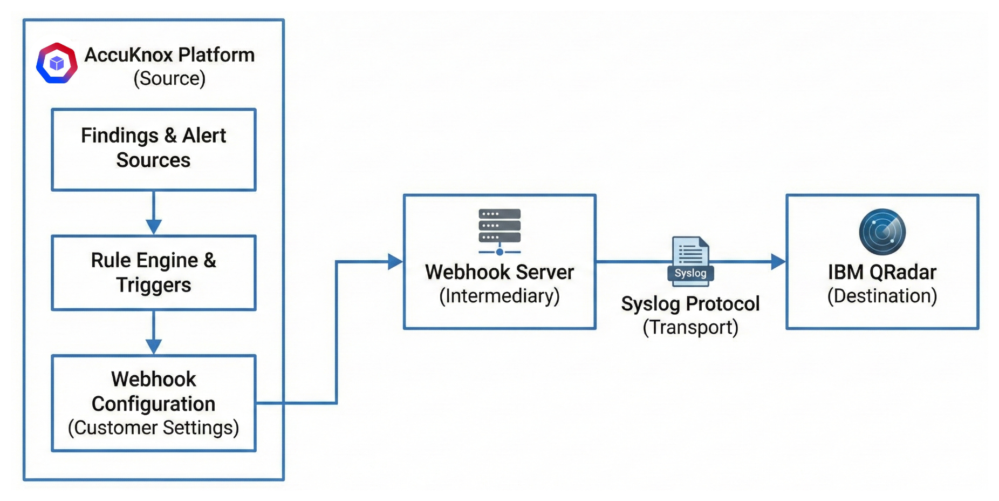

### Architecture Components

1. AccuKnox platform (source)
2. Webhook server (intermediary)
3. Syslog protocol (transport)
4. IBM QRadar (destination)

### Customer Integration Process

- Configure webhook in AccuKnox (See [**Webhook Integration Guide**](https://help.accuknox.com/integrations/webhook-integration/)).
- Set up QRadar configuration (customer responsibility).
- Report configuration completion back to AccuKnox.

---

## Connector and Send Event

1. Log in to QRadar as `Admin`.

    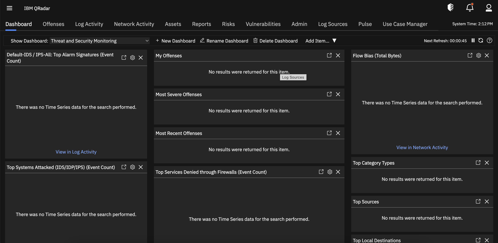

2. Click `Admin` and then `Data Source`.

    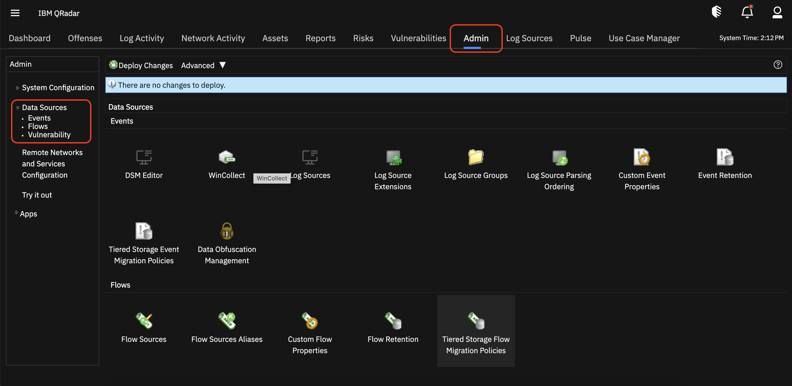

3. Click `Log Source`.

    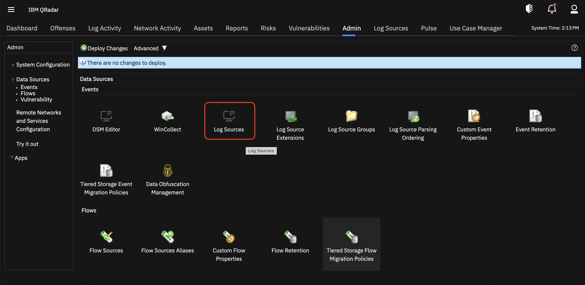

4. Click `+ New Source Log` -> `Single Source`.

    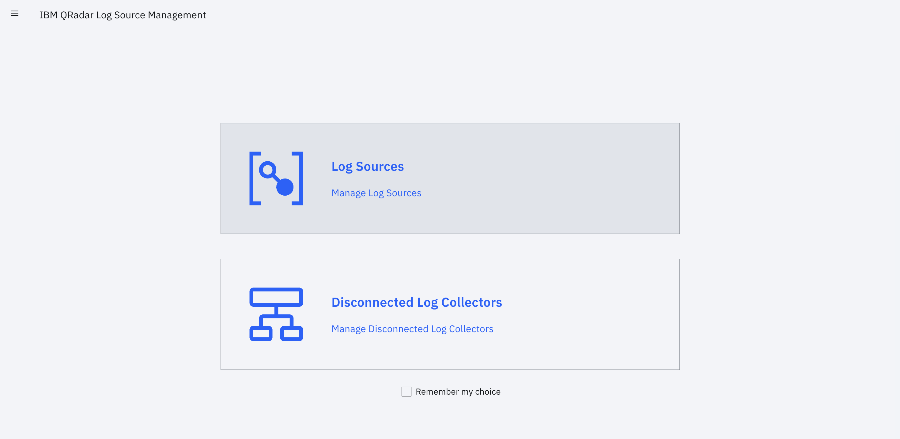

    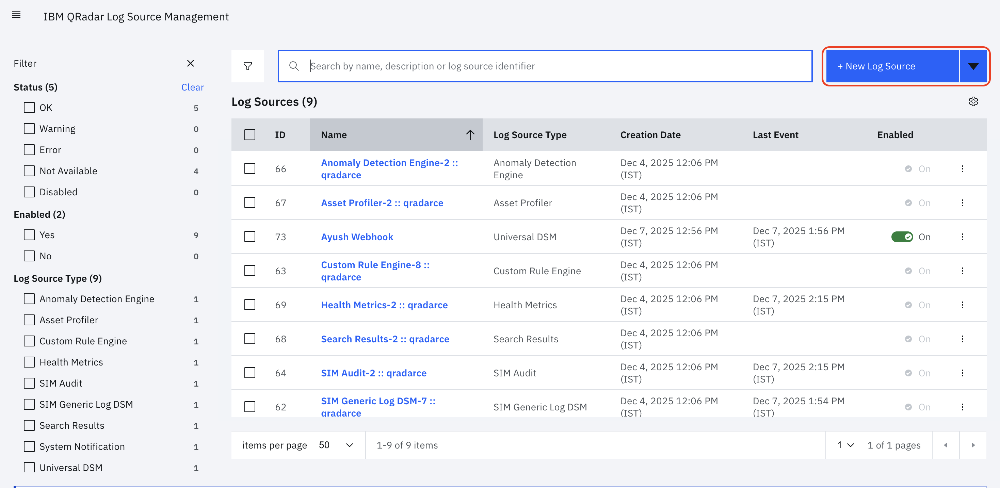

5. Configurations:
    1. Select Log Source Type - `Universal DSM`
    2. Select a Protocol - `Syslog`
    3. Name - `Test Qradar`
    4. Log Source Identifier - `192.168.1.226` (Source IP from which Log is forwarded to Qradar)

    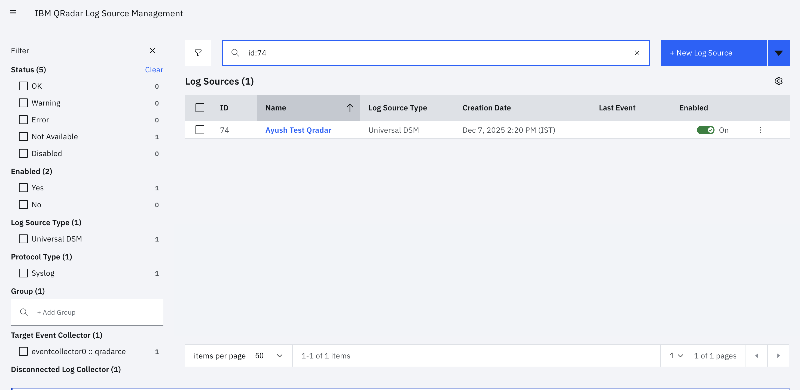

6. Go back to `Admin` again to deploy changes. Click `Deploy Changes`, wait for changes to be deployed.

    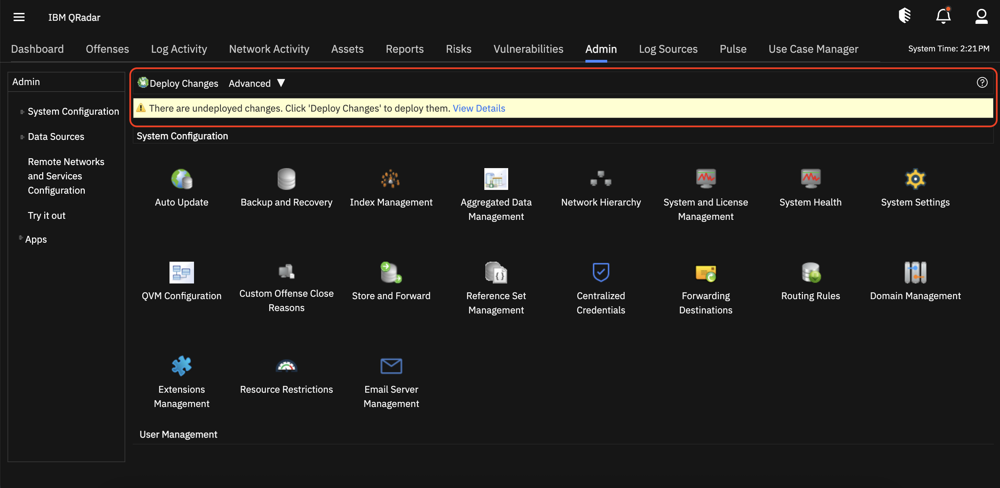

    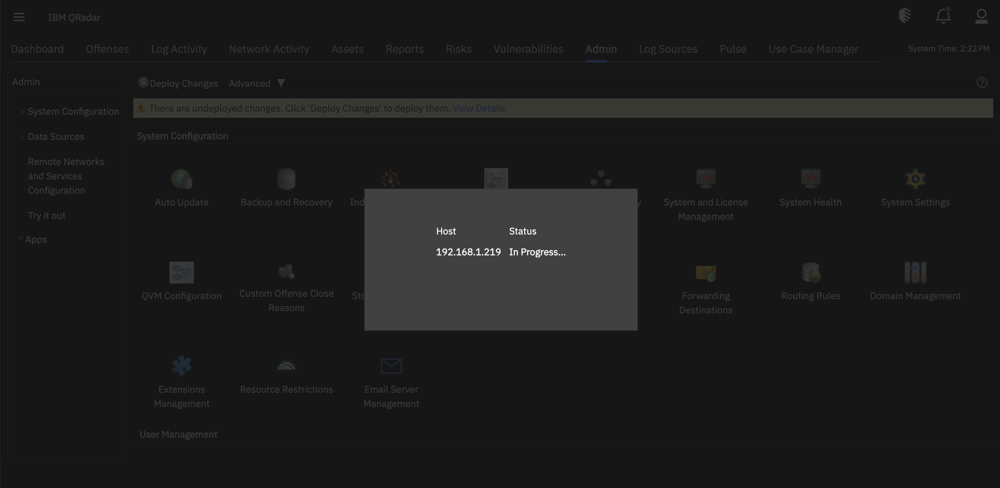

7. Now go to `Log Activity` to see All Alerts.

8. Now trigger the Event. You will be alerted in real-time in the Qradar UI.
    1. Test Event

        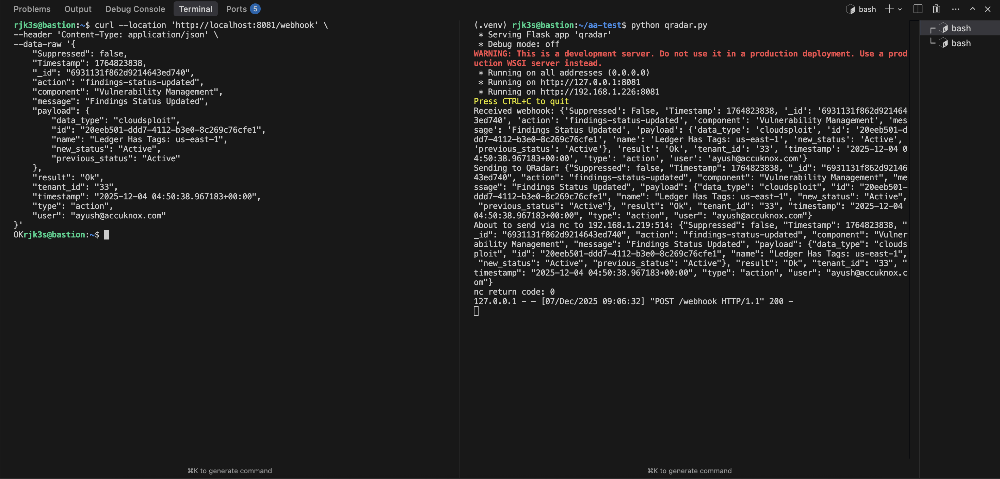

    2. Event in Qradar UI

        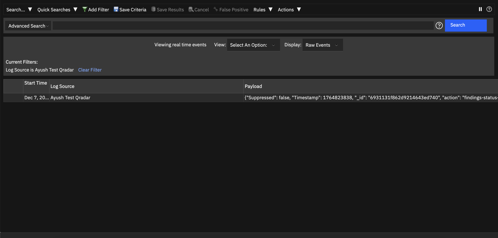

        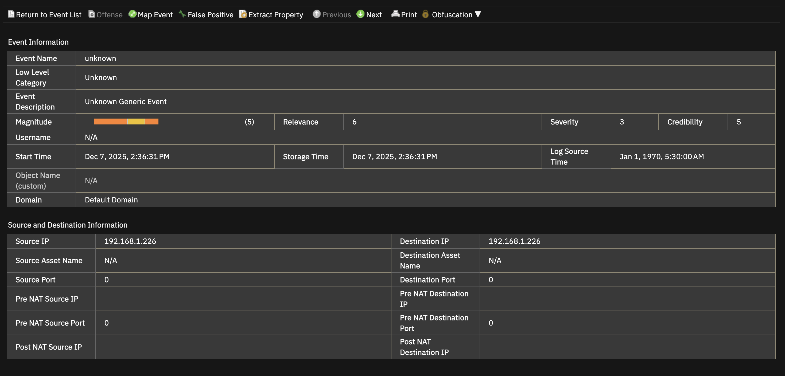

        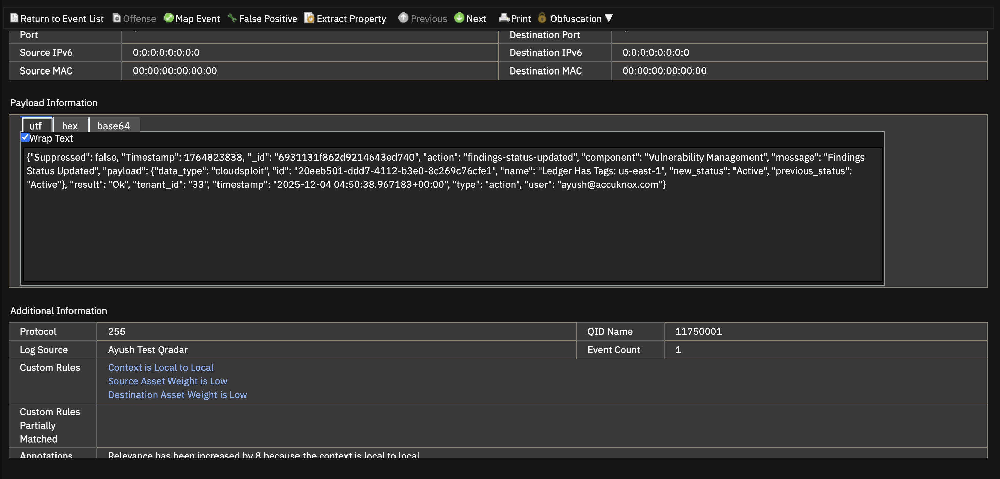

## Check QRadar IP

1. Go to Admin.
2. Click System Configuration.
3. Click `System and License Management`.

    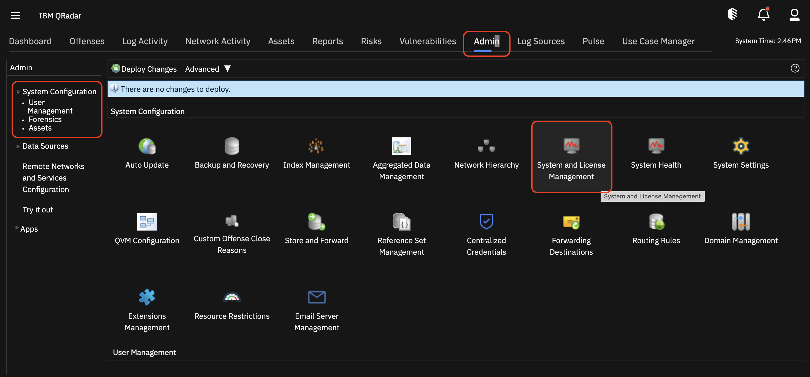

    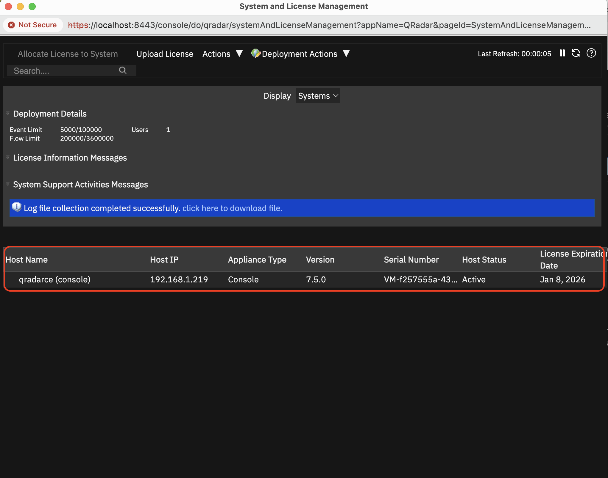
