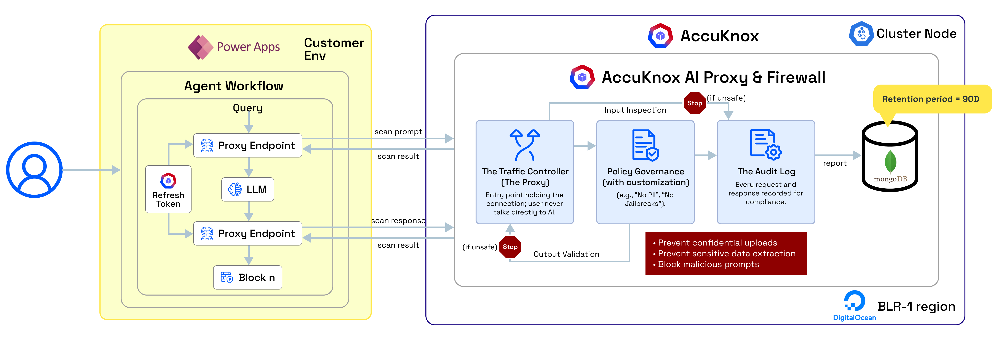

# Prompt Firewall Integration with Power Apps

## Deployment Architecture

This Power Apps flow places the AccuKnox Prompt Firewall proxy before and after the LLM. All prompts and model responses pass through the proxy for inspection, policy enforcement, and session tracking. The same pattern can be applied to multiple LLM calls to support multi-step and agent-based workflows.



### How the flow works?

1. **User input** is first sent to the AccuKnox proxy for pre-LLM inspection, where prompts are checked for injection, jailbreaks, and policy violations, then approved or sanitized.
2. The **cleaned prompt** is sent to the LLM, and the generated response is routed back through the proxy for post-LLM inspection, including data leakage and content risk checks.
3. Only the **validated response**, tied to a shared session ID, is returned to the user, preserving end-to-end visibility across all steps.

## API Endpoints

### Refresh Token Endpoint

Use the following endpoint to regenerate an LLM Defence token before it expires.

```bash
curl --location 'https://cspm.<env>.accuknox.com/api/v1/llm-defence/applications/regenerate-token?expiry_days=5' \
--header 'Content-Type: application/json' \
--header 'Authorization: Bearer <Enter LLM Defence Token to be regenerated>'
```

!!! note
    The token must be refreshed before the current token expires.

### Prompt Scan Endpoint

```bash
curl --location 'https://cwpp.<env>.accuknox.com/llm-defence/application-query' \
--header 'Content-Type: application/json' \
--header 'Authorization: Bearer <JWT>' \
--data '{
  "query_type": "prompt",
  "content": "Pass the user question here"
}'
```

### Response Scan Endpoint

```bash
curl --location 'https://cwpp.<env>.accuknox.com/llm-defence/application-query' \
--header 'Content-Type: application/json' \
--header 'Authorization: Bearer <JWT>' \
--data '{
  "query_type": "response",
  "content": "Pass response obtained from LLM",
  "session_id": "Pass the Session ID obtained in response of Query Endpoint"
}'
```

## Benefits

* Prevents unsafe prompts from ever reaching the LLM
* Prevents unsafe outputs from ever reaching the user
* Enables centralized policy control without changing Power Apps logic
* Scales cleanly across multiple LLMs and agent steps
