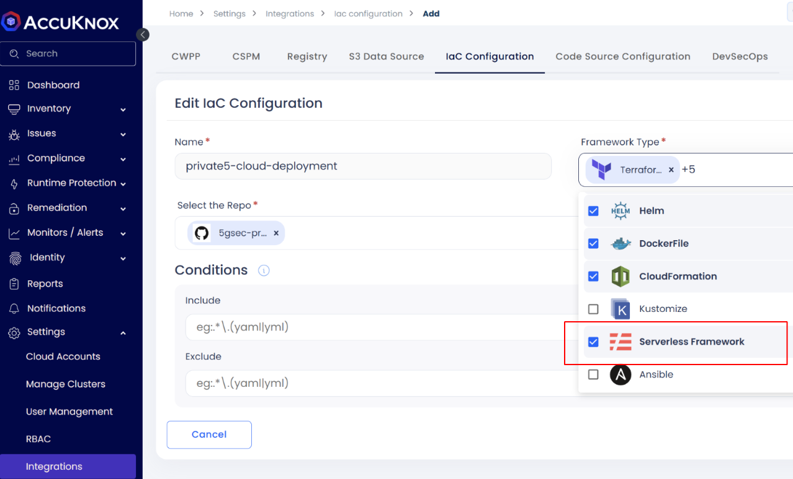

# Serverless Security Integrations

AccuKnox integrates with various serverless frameworks and platforms to provide comprehensive security from code to runtime.

::cards:: cols=2
- title: Serverless Function Scan
  content: Scan functions for permissions, secrets, and compliance.
  image: ../icons/1.png
  url: /use-cases/serverless-security/#serverless-function-scan
- title: Serverless Image Scan
  content: Vulnerability and supply chain security for serverless container images.
  image: ../icons/2.png
  url: /use-cases/serverless-security/#serverless-image-scan
- title: AWS Lambda Security
  content: Secure Lambda functions and accessory services (S3, SQS, SNS).
  image: ../icons/3.png
  url: /use-cases/serverless-security/#aws-lambda-security
- title: Knative Serverless
  content: Runtime visibility and security for Knative clusters.
  image: ../icons/4.png
  url: /use-cases/serverless-security/#knative-serverless-security
::/cards::

## Configuration

To enable Serverless scanning integrations in the AccuKnox dashboard:

**Settings > Integrations > IaC Configurations > Set Framework Type to Serverless**

