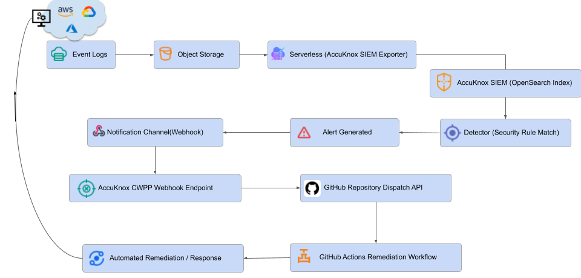
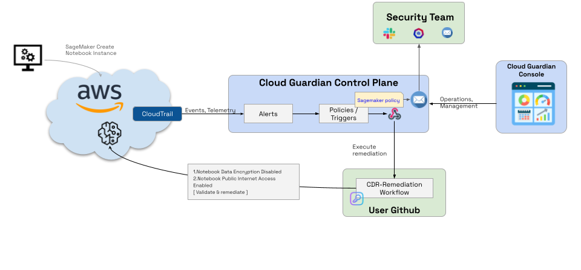
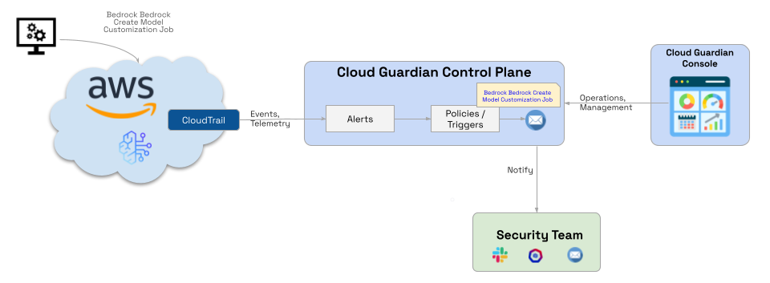
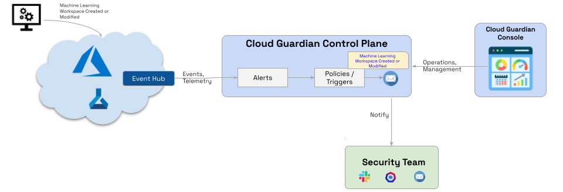
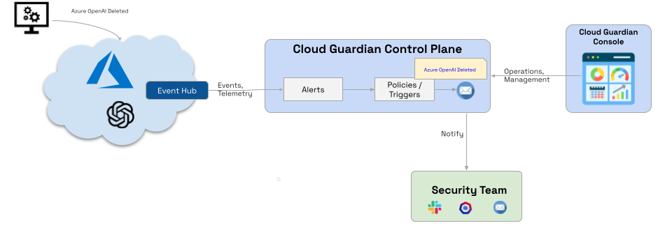

# AI Detection and Response (AI-DR)

AI-DR provides continuous detection, investigation, and response for AI and GenAI workloads running across cloud environments. It focuses on **high-risk AI operations**, **governance gaps**, and **automated remediation**, without disrupting developer workflows.

## What Is AI-DR

- Monitors AI/ML control-plane activity across cloud providers.
- Evaluates actions against security policies.
- Triggers alerts, creates tickets, and can auto-remediate risky or unauthorized actions.
- Designed for environments with privileged, ephemeral, and automated AI assets.
- Delivers continuous visibility, policy-based detection, automated response, and audit trails for compliance.

## When AI-DR Is Applicable

AI-DR is most useful when organizations use managed AI services like SageMaker, Bedrock, Azure ML, or Azure OpenAI, and allow multiple teams to create or modify AI assets. It is also critical for teams that need auditability for AI operations and want automated response instead of manual reviews.

Common trigger scenarios include model customization jobs, notebook creation with insecure settings, workspace configuration changes, and destructive actions like model or service deletion.

## AI-DR Architecture Overview

AI-DR ingests cloud and AI service events, evaluates them using policies, and orchestrates response actions through alerts, tickets, and automation.

!!! note "Key Components"
    Key components include cloud event sources (CloudTrail, Event Hub), the AccuKnox detection engine, policy and rule evaluation, alerting and ticketing, and automated remediation workflows.

## AI-DR Workflow

The AI-DR workflow begins when AI service activity generates control-plane events. These events are collected from cloud-native logging services, after which policies evaluate actions for risk and compliance. If violations are detected, alerts are generated. Finally, tickets and remediation workflows are triggered, and all actions are audited and tracked end-to-end.

!!! info
    AI-DR operates out-of-band and does not sit in the request or inference path.

## AI-DR Use Cases

Below are four common AI-DR detection scenarios, each mapped to a specific AI risk.

### 1. AWS SageMaker Notebook Created

This use case detects the creation of notebook instances with insecure configurations.

**Checks and Response**

The system checks for public internet access, disabled encryption, and over-permissive IAM roles. Upon detection, it alerts security teams, creates remediation tickets, and can trigger automated fixes if enabled.

### 2. AWS Bedrock Model Customization Job

This use case monitors model fine-tuning and customization actions.

**Checks and Response**

It checks for unauthorized customization jobs, unapproved datasets or parameters, and policy violations during model changes. The response includes immediate notification, an audit trail for model governance, and an optional remediation workflow.

### 3. Azure ML Workspace Created or Modified

This tracks the creation and modification of ML workspaces.

**Checks and Response**

The system checks for network exposure, identity and access misconfigurations, and drift from approved baselines. If issues are found, it generates alerts, creates tickets with context, and enforces policy-driven actions.

### 4. Azure OpenAI Resource Deleted

This detects the deletion of Azure OpenAI resources.

**Impact and Response**

This is monitored because it is a high-risk, irreversible action with potential availability or compliance impacts. The response includes a high-severity alert, security team notification, and investigation and audit logging.

!!! warning
    Destructive AI actions are treated as critical-risk events by default.
