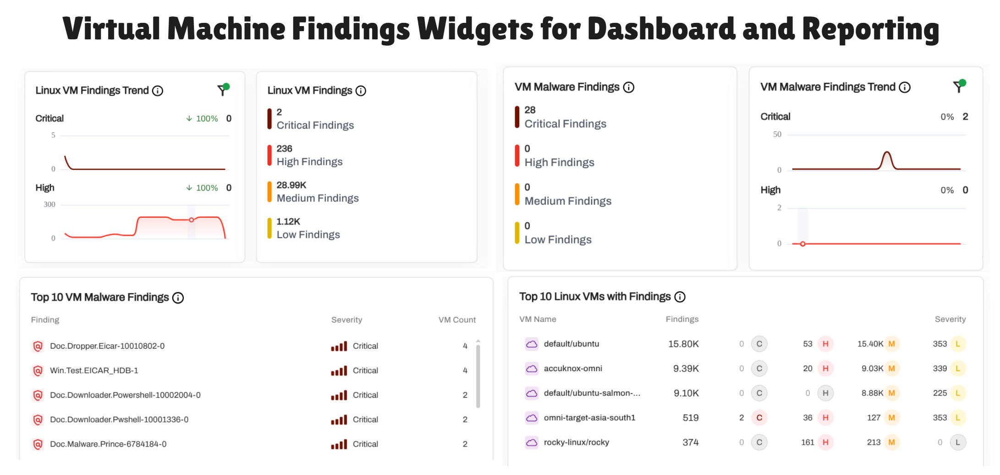
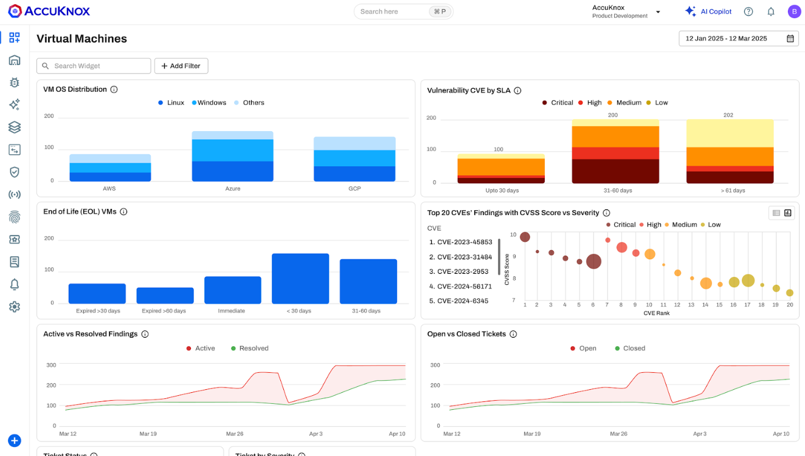
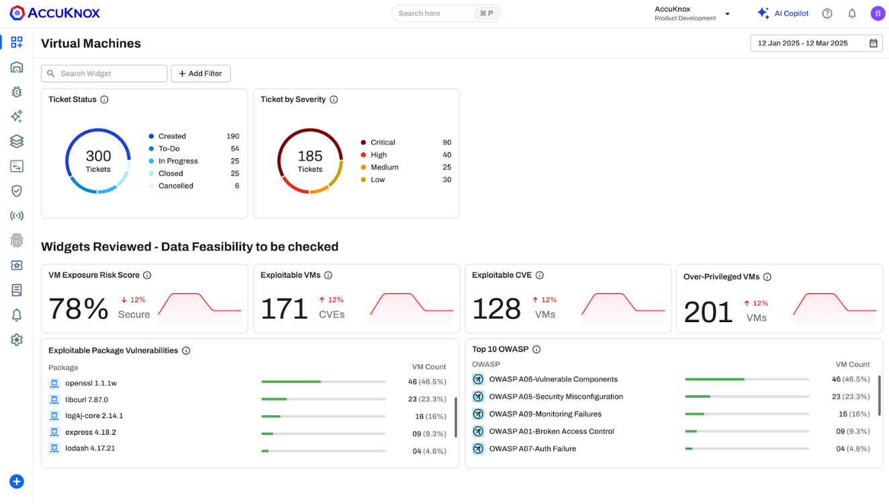

# Host Security Scans with AccuKnox

AccuKnox VM Security agent-based scanning supports **Linux and Windows**. It is designed for continuous vulnerability and optional malware detection with flexible deployment models.

!!! tip "Getting Started"
    Follow the guides below to set up VM security:

    - [Agent-based Linux VM Scanning](https://help.accuknox.com/how-to/vm-security/agent-based/linux/)
    - [Agent-based Windows VM Scanning](https://help.accuknox.com/how-to/vm-security/agent-based/windows/)

A lightweight Omni agent runs on the VM and performs scheduled scans. Results are sent to the AccuKnox SaaS for centralized visibility.

- **Linux**: Uses a systemd service and timer.
- **Windows**: Uses a scheduled task.
- **Malware Scanning**: Optional and disabled by default due to CPU cost. Resource usage can be capped.
- **Air-gapped Environments**: Supported by pre-downloading binaries and vulnerability databases and installing without outbound internet access.

## Centralized Visibility

Scans are tied to tenant-level tokens and labels for identification, grouping, and reporting. Findings are centralized in the AccuKnox console for visibility, correlation, and reporting across workloads.

## Vulnerability Detection Use Cases

AccuKnox performs deep scans of the host environment to provide rich risk assessment for both hosts and network infrastructure, detecting critical vulnerabilities and misconfigurations.

### **Apache Log4j**

The CVE-2021-44228 RCE vulnerability affects Apache's Log4j library. An adversary can exploit this by submitting a specially crafted request to a vulnerable system to execute arbitrary code. AccuKnox Host Scan detects critical vulnerabilities like Apache Log4j and provides steps to remediate them.

#### **Solution**

Upgrading the package to the latest supported version will remediate the vulnerability

### **Microsoft RDP RCE (CVE-2019-0708)**

A remote code execution vulnerability exists in Remote Desktop Services. An attacker who successfully exploited this vulnerability could execute arbitrary code on the target system. AccuKnox detects the Microsoft RDP RCE and provides descriptive solutions to help organizations patch the critical vulnerability.

#### Solution

Microsoft has released a set of patches for OS having CVE-2019-0708, Installing the security patch will remediate the vulnerability.

### **MS11-020: Vulnerability in SMB Server**

The remote host is affected by a vulnerability in the SMB server that may allow an attacker to execute arbitrary code or perform a denial of service against the remote host. AccuKnox scans the host to identify vulnerabilities related to outdated components, packages, operating systems, file systems, and more.

#### Solution

Microsoft has released the security patches which need to be installed to remediate the security issues. To remediate this, users can create tickets from AccuKnox Saas UI with the details of the findings.

